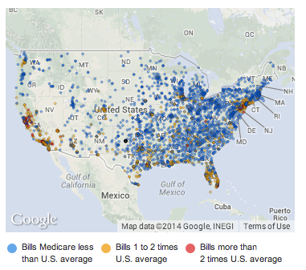

```{r include=FALSE}
require(DCFdevel)
require(mosaic)
require(reshape2)
knitr::opts_chunk$set(tidy=FALSE,echo=FALSE)
library(maps)
#load us map data
all_states <- map_data("state")
#plot all states with ggplot
```

## Background

In May 2013, the [Centers for Medicare and Medicaid Services](http://www.cms.gov/Research-Statistics-Data-and-Systems/Statistics-Trends-and-Reports/Medicare-Provider-Charge-Data/index.html) released data on the price Medicare fee-for-service health services at hospitals around the US in year 2011.  They wrote:

> As part of the Obama administration’s work to make our health care system more affordable and accountable, data are being released that summarize the utilization and payments for procedures and services provided to Medicare fee-for service beneficiaries by specific inpatient and outpatient hospitals, physicians, and other suppliers. These data include information for the 100 most common inpatient services, 30 common outpatient services, and all physician and other supplier procedures and services performed on 11 or more Medicare beneficiaries. Providers determine what they will charge for items,services, and procedures provided to patients and these charges are the amount the providers bill for an item, service, or procedure. -[source](http://www.cms.gov/Research-Statistics-Data-and-Systems/Statistics-Trends-and-Reports/Medicare-Provider-Charge-Data/index.html)

This attracted press attention.  For example, a headline in the New York Times read ["Hospital Billing Varies Wildly, Government Data Shows"](http://www.nytimes.com/2013/05/08/business/hospital-billing-varies-wildly-us-data-shows.html).  



A [map with the article](http://www.nytimes.com/interactive/2013/05/08/business/how-much-hospitals-charge.html?_r=0) shows the geographic disparities in hospital charges.  

## Goals for the Study

The news reports emphasized geographic disparities in the billing for procedures.  I'm interested to know whether this might depend on other variables, for instance:

1. The type of procedure.
#. The number of the type of procedure performed at the hospital.
#. The population in the locality.
#. Age, wealth, and other demographic characteristics of the area.

## Data

The data themselves are distributed by the Centers for Medicare and Medicade Services as a [zip-compressed CSV file](http://www.cms.gov/Research-Statistics-Data-and-Systems/Statistics-Trends-and-Reports/Medicare-Provider-Charge-Data/Downloads/IPPS_DRG_CSV.zip). 

The [download page](http://www.cms.gov/Research-Statistics-Data-and-Systems/Statistics-Trends-and-Reports/Medicare-Provider-Charge-Data/Physician-and-Other-Supplier.html) describes the formats available.


> Data are available in two formats:

>    * Tab delimited file format (requires importing into database or statistical software; SAS® read-in language is included in the download ZIP package)
>    * Microsoft Excel format (.xlsx), split by provider last name (note: organizational providers with name starting with a numeric are available in the “YZ” file).
    
> CMS has also created two summary tables: 1) aggregated information by physician or other supplier and 2) aggregated information by State and HCPCS code.   A detailed methodology document can be found in the Downloads section below which contains important information regarding the limitations of data usage.

> **Tab Delimited Format:**

> Medicare Physician and Other Supplier PUF, CY2012, Tab Delimited format
[Note: This Compressed ZIP package contains the tab delimited data file (Medicare-Physician-and-Other-Supplier-PUF-CY2012.txt) which is 1.7GB uncompressed and contains more than 9 million records, thus importing this file into Microsoft Excel will result in an incomplete loading of data.  Use of database or statistical software is required; a SAS® read-in statement is supplied.  Additionally, this ZIP package contains the following supporting documents: CMS-AMA-CPT-2011-license-agreement.pdf, Medicare-Physician-and-Other-Supplier-PUF-SAS-Infile.sas, Medicare-Physician-and-Other-Supplier-PUF-Methodology.pdf]

> **Microsoft Excel Format:**

> Medicare Physician and Other Supplier PUF, CY2012, Microsoft Excel (.xlsx) Provider Last Name (A)    
> Medicare Physician and Other Supplier PUF, CY2012, Microsoft Excel (.xlsx) Provider Last Name (B)    
> Medicare Physician and Other Supplier PUF, CY2012, Microsoft Excel (.xlsx) Provider Last Name (CD)    
> Medicare Physician and Other Supplier PUF, CY2012, Microsoft Excel (.xlsx) Provider Last Name (EFG)    

... and so on.

### Getting the Data

The compressed tab-delimited file is 395 MB.  Uncompressed it's 1700 MB. This seems large. 

How do I even look at these data?  Could a student manage this in the time frame of, say a course project?

I downloaded the tab-delimited file (taking about 45 minutes with a broadband connection), uncompressed it (taking about 0.5 % of my disk space), read it into R, and then saved it in a standard R format.  It's now part of the `DCFdevel` package.

```{r}
fileName <- "/Users/kaplan/KaplanFiles/DCF-2014/CaseStudies/MedicareSpending/CMS-data-2013-05-06.rda"
load(fileName)
MedicareSpending <- med
```

Perhaps surprisingly, all that data, in the standard R format, is only `r round(file.info("CMS-data-2013-05-06.rda")$size/1e4)/100` MB. What accounts for the disparity?  Do I have the right data?

#### Checking the Data

The New York *Times* says:

> The data for 3,300 hospitals, released by the federal Centers for Medicare and Medicaid Services, shows wide variations not only regionally but among hospitals in the same area or city.

A quick summary of the data using commands that students might encounter in an introductory statistics course:
```{r}
nrow( MedicareSpending )
names( MedicareSpending )
with( MedicareSpending, length(levels(Provider.Name) ) )
```

That corresponds well with the New York *Times* description.

So why are there `r nrow(MedicareSpending)` rows if there are only 3201 hospitals?  Because there is a separate listing for each of 100 procedures (known as a Direct Recovery Group (DRG)).

```{r}
with( MedicareSpending, length(levels(DRG.Definition)))
```

A typical provider is listed roughly 50 times.  More precisely, each provider is listed this many times on average: 

```{r}
nrow( MedicareSpending ) / 
  with( MedicareSpending, length(unique(Provider.Name)))
```

That's an ugly command.  `MedicareSpending` is listed twice.  

We're going to be using a different system for data calculations, called `dplyr`.

```{r}
MedicareSpending %>% 
  summarize( aveProc=n()/length(unique(Provider.Name)))
```


## How much is Spent?

As part of a sanity check of the data, look at how much Medicare paid out for these services.  We expect that it will be several billion dollars.

```{r}
MedicareSpending %>% summarize( 
           TotalPaid=sum(Total.Discharges*Average.Total.Payments,na.rm=TRUE),
           TotalCharged=sum(Total.Discharges*Average.Covered.Charges,na.rm=TRUE)
           ) / 1e9
```

$246 billion was charged.  "Only"" $67 billion was paid

## How much do payments and charges vary by state?


```{r}
MedicareSpending %>% group_by(Provider.State) %>%
  summarize( 
    TotalPaid = mean( Average.Total.Payments, na.rm=TRUE ),
    TotalCharged = mean( Average.Covered.Charges, na.rm=TRUE )
    )  -> StateCharges

tmp <- transform( StateCharges, State=reorder( Provider.State, TotalPaid ))
ggplot( melt(tmp,variable.name="Amount"), aes(x=State, y=value/1000, color=Amount)) +
  geom_point( ) + scale_y_log10(breaks=c(1,5,10,15,20,30,40)) + 
  xlab("State") + ylab("1000 USD per procedure")
```

Maybe better to show the variation within states:
```{r}
tmp <- select(MedicareSpending, State=Provider.State, 
              Charged=Average.Covered.Charges,
              Paid=Average.Total.Payments)
tmp %>% transform(State=reorder(State, Paid, FUN=median)) -> tmp
tmp2 <- melt(tmp,variable.name="Amount")
ggplot( tmp2, aes(x = State, group = State, y = value/1000)) +
  geom_boxplot( ) + scale_y_log10(breaks = c(1,5,10,15,20,30,40,80,160,320)) + 
  xlab("State") + ylab("1000 USD per procedure") + facet_grid( ~Amount )
```

Now by DRG:

```{r}
# Transform the codes to just their numbers.
DRGnums <- substr(as.character(levels(MedicareSpending$DRG.Definition)),0,3)
MedicareSpending$DRG <- factor(MedicareSpending$DRG.Definition, labels=DRGnums)
```

## Range of Costs by DRG

```{r}
MedicareSpending %>% select( State=Provider.State,
              Charged=Average.Covered.Charges,
              Paid=Average.Total.Payments,
              DRG) -> tmp 
tmp %>%  mutate(DRG=reorder(DRG, Paid, FUN=median)) %>%
  sample_n(size=100000) -> tmp
tmp2 <- melt(tmp,variable.name="Amount")
ggplot( tmp2, aes(x = DRG, y = value/1000)) +
  geom_boxplot( ) + scale_y_log10(breaks = c(1,5,10,15,20,30,40,60,80,100,150,200,300,500)) + 
  xlab("DRG") + ylab("1000 USD per procedure") + facet_grid( ~Amount )
```

## Comparing the 3 highest and 3 lowest cost states and some other big ones

```{r}
nstates <- 3
tmp <- arrange(StateCharges,TotalPaid)
extremes <- rbind(head(tmp,nstates),tail(tmp,nstates))$Provider.State
extremes <- c(as.character(extremes),'NY','CA','TX','MN')
MedicareSpending %>% 
  select( State=Provider.State,
              # Charged=Average.Covered.Charges,
              Paid=Average.Total.Payments,
              DRG) %>%
  mutate(DRG=reorder(DRG, Paid, FUN=median)) %>%
  filter( State %in% extremes) -> ExtremeStates
ggplot( ExtremeStates, aes(x = DRG, y = Paid/1000)) +
  geom_boxplot( ) + scale_y_log10(breaks = c(1,5,10,15,20,30,40,60,80,100,150,200,300,500)) + 
  xlab("DRG") + ylab("1000 USD per procedure") + facet_wrap( ~ State, nrow=3 )
```

The DRGs vary in the same way within a state.  Let's pick one DRG to investigate.  Perhaps the one that appears in the most states.

```{r}
MedicareSpending %>% select( State=Provider.State,
              Charged=Average.Covered.Charges,
              Paid=Average.Total.Payments,
              DRG, ZIP=Provider.Zip.Code) -> SmallMed
SmallMed %>% group_by(DRG) %>% 
  summarize( med = median(Paid), nStates=length(unique(State)), 
             nZips=length(unique(ZIP))) %>%
  arrange(med) %>% 
  filter( rank(med) %in% c(45:55))
```

Let's take DRG 872: **SEPTICEMIA OR SEVERE SEPSIS W/O MV 96+ HOURS W/O MCC**

```{r}
SmallMed %>% filter( DRG=='872') -> DRG872
```

## Bring in the ZIPs

This service is provided in `r nrow(DRG872)` ZIP codes.  Almost all of those ZIP codes have only one provider:

```{r}
table(table(DRG872$ZIP))
```

How much does the cost differ by state?

```{r}
DRG872 %>% group_by(State) %>% mutate(med=median(Paid)) -> tmp
DRG872$State <- reorder(DRG872$State, tmp$med)
ggplot(DRG872, aes(x=State, y=Paid)) + 
  geom_boxplot(color='red',fill=NA, aes(y=Charged)) + 
  geom_boxplot(fill=NA) + scale_y_log10(breaks=c(1000,2000,4000,8000,15000,30000,60000,120000,240000))
```

Let's pick some ZIP code variables:
```{r}
data(ZipDemography)
data(ZipGeography)
ZD <- select(ZipDemography, ZIP, Pop=Totalpopulation,
             Over65=X65yearsandover,
             College=Bachelorsdegreeorhigher,
             Disabled=Disabilitystatuspopulation21to64years,
             Income=Medianhouseholdincomedollars)
ZG <- select(ZipGeography, ZIP, Latitude, Longitude, LandArea)
Zips <- inner_join(ZD, ZG) %>% mutate(ZIP = as.character(ZIP))

DRG872 <- mutate(DRG872, ZIP=as.character(ZIP)) %>% inner_join( Zips)
```


## Looking at Charged versus demography

```{r, dev='png'}
ggplot( DRG872, aes(x=Over65/Pop, y=Charged)) +
  geom_point() + scale_y_log10() 
ggplot( DRG872, aes(x=Income, y=Charged)) +
  geom_point() + scale_y_log10() 
ggplot( DRG872, aes(x=LandArea, y=Charged)) +
  geom_point() + scale_y_log10() + scale_x_log10()
ggplot( DRG872, aes(x=Pop/LandArea, y=Charged)) +
  geom_point() + scale_y_log10() + scale_x_log10()
```

```{r}
DRG872 <- transform(DRG872, Rgroup=ntiles(Charged,4))
ggplot(DRG872, aes(x=Longitude,y=Latitude,color=Rgroup)) + 
  geom_point() + facet_wrap(~ Rgroup,nrow=2) + geom_polygon( data=all_states, aes(x=long, y=lat, group = group),colour="white", fill=NA )
```

## Doing things for all the DRGs

Fit `log(Charge)` to `DRG` and take the residual.

```{r}
mod <- lm(log10(Charged) ~ DRG, data = SmallMed)
SmallMed$Resid <- resid(mod)
SmallMed <- mutate(SmallMed, ZIP=as.character(ZIP)) %>% inner_join( Zips)
```

```{r dev='png'}
SmallMed$State <- reorder(SmallMed$State, SmallMed$Resid)
ggplot( SmallMed, aes(x=State, y=Resid)) + geom_boxplot()
ggplot( SmallMed, aes(x=Pop/LandArea, y=Resid)) +
  geom_point(alpha=.02) + scale_x_log10()
```

```{r}

SmallMed <- transform(SmallMed, Rgroup=ntiles(Resid,9))
ggplot(SmallMed, aes(x=Longitude,y=Latitude,color=Rgroup)) + 
  geom_point() + facet_wrap(~ Rgroup,nrow=3) + geom_polygon( data=all_states, aes(x=long, y=lat, group = group),colour="white", fill=NA )
```


## Models?

```{r}
mod2 <- lm(Resid ~ 
             I(Pop/LandArea) + Income + I(College/Pop), data=SmallMed )
rsquared(mod2)
anova(mod2)
mod3 <- lm(Resid ~ I(Pop/LandArea) + Income + I(College/Pop) + State + Latitude, data=SmallMed )
rsquared(mod3)
anova(mod3)
```

Can we capture the effect of `State` with demographic variables?


## Normalizing the Data

