Viewing Wind Vectors of US, Mexico, and Central America
========================================================


```r
require(ggplot2)
require(grid)
require(openair)

load("../data/wind-2014-1949-comparisons.Rda")
source("../geom-arrow.R")
```

Wind consists of both *speed* and *direction*.  How can we visualize both of these elements on a map to get a sense of wind patterns?

One way of doing this is a *vector field*.  For each wind measurement, we plot an arrow that points in the direction that the wind is going, and with the length of the arrow corresponding to the speed.

Using this technique, we can visualize the region of US, Mexico, and Central America in May 31, 2014 at 12:00 noon.  This data is contained in the `R` object called "`may2014`".  We can see what variables are in this `R` object using `str()`:


```r
str(may2014)
```

```
## 'data.frame':	576 obs. of  7 variables:
##  $ lat  : num  50 47.5 45 42.5 40 37.5 35 32.5 30 27.5 ...
##  $ long : num  -140 -140 -140 -140 -140 -140 -140 -140 -140 -140 ...
##  $ date : POSIXct, format: "2014-05-30 12:00:00" "2014-05-30 12:00:00" ...
##  $ u    : num  1.6 2.9 3 0.9 0.4 ...
##  $ v    : num  6.6 5.6 3.6 -0.1 -1 ...
##  $ speed: num  8.2 8.5 6.6 0.8 0.6 ...
##  $ angle: num  1.333 1.093 0.876 -0.111 -1.19 ...
```

Then, we can set things up and plot:


```r
scaling <- 2.5/max(may2014$speed) # determines scale of arrows

## These cover continental US down to the top tip of South America
lats <- c(5, 55)
longs <- c(-145, -55)

ggplot(may2014, aes(x = long, y = lat)) +
  borders(database = "world") + 
  geom_arrow(aes(length = speed*scaling, angle = angle)) +
  coord_equal(xlim = longs, ylim = lats) +
  ggtitle("Wind Patterns at Noon: May 30, 2014")
```

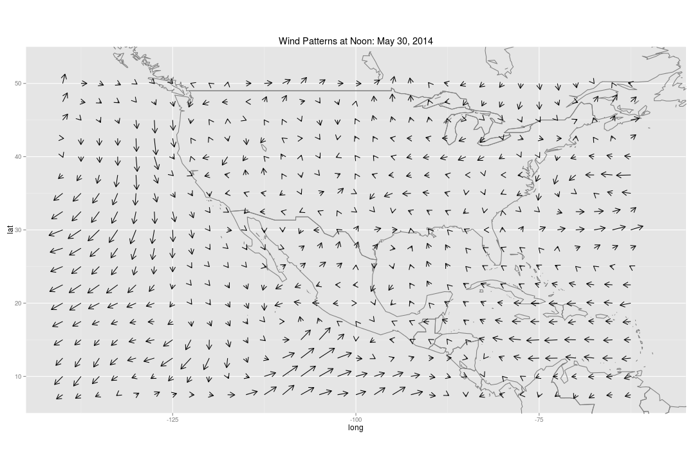 

What features do you notice?  Where are the fastest wind measurements?  Are their any prominent extended streams (a series of vectors that form a connected pathway)?

## Understanding the commands

The first few lines, here, are just to set a few constants to help tell `R` how we should plot.  `scaling` is to set the scale of the arrows, since that is relatively arbitrary; here, it's set up so that the maximum speed corresponds to 2.5° on the map.  We choose this value because the data has observations on a 2.5° by 2.5° grid. `lats` and `longs` just give the rectangular area that we're focusing on, in latitude and longitude.

To plot, we first map the `may2014` longitude  (`long`) onto the x axis, and latitude (`lat`) onto the y axis of our plot, and add on `borders(database = "world")` to draw the country boundaries to give us some context.  If we just did this, we'd see the whole world and no data:


```r
ggplot(may2014, aes(x = long, y = lat)) +
  borders(database = "world")
```

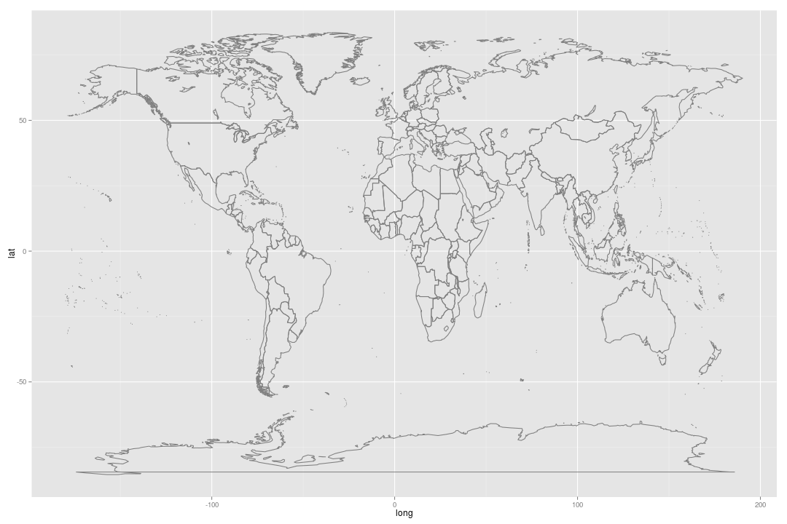 

Now, we want to add on our arrows, which we do using a custom command (not included in `ggplot2`) called `geom_arrow`.  This has two aesthetics we want to use: **`length`** to specify the length of the arrow and **`angle`** to specify its direction (in radians, where an angle of 0 points eastward).

Here, we're going to use the scaling factor we defined above in order to tell `R` how long the arrows should be.  So, we multiply the variable `speed` by the `scaling`.  `angle` doesn't need any special scaling.

Again, if we stopped here, we'd see this:


```r
ggplot(may2014, aes(x = long, y = lat)) +
  borders(database = "world") + 
  geom_arrow(aes(length = speed*scaling, angle = angle))
```

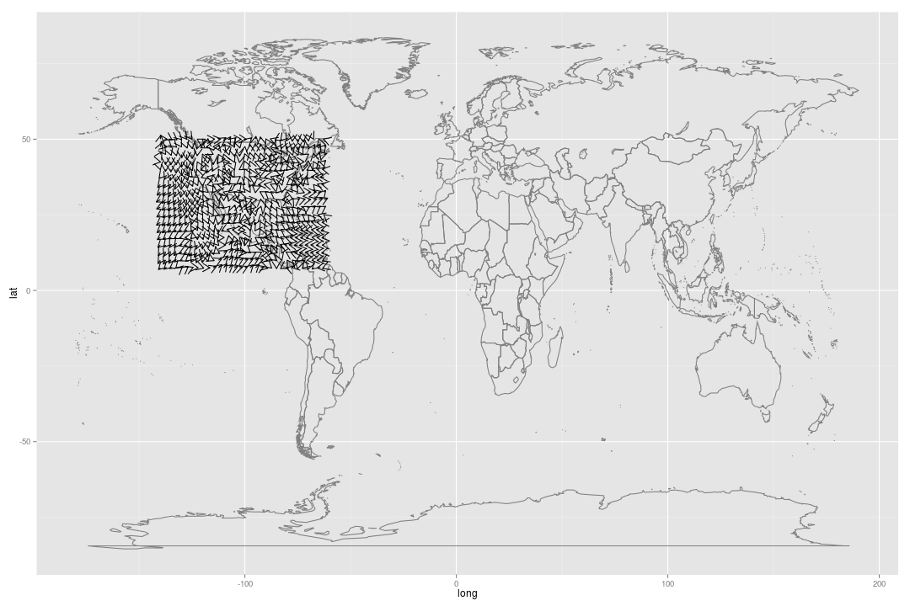 

It's hard to see much when we're this zoomed out!  We can equalize the x and y axes and set the boundaries of our plot with the `coord_equal` command (which stands for "equal coordinates").  This takes two arguments, `xlim` and `ylim` which are vectors specifying the limits of the plot that we want to zoom in on.  Then, we can simply add a title using `ggtitle`, and we're done:


```r
ggplot(may2014, aes(x = long, y = lat)) +
  borders(database = "world") + 
  geom_arrow(aes(length = speed*scaling, angle = angle)) +
  coord_equal(xlim = longs, ylim = lats) +
  ggtitle("Wind Patterns at Noon: May 30, 2014")
```

 
  
Of course, this is just one day.  How much changes in these patterns do we see over time?  Do spring and fall have similar or different wind patterns?  Would the same day of the year be pretty much the same year after year?

# Practicing the wind vector field

## November, 2013
Were wind patterns different at this same time 6 months before? The data for 6 months before is in an `R` object called `nov2013`.

Create a graph below, with an appropriate title, that shows the wind vector graph of the same region on November 30, 2013.

<aside>

```r
ggplot(nov2013, aes(x = long, y = lat)) +
  borders(database = "world") + 
  geom_arrow(aes(length = speed*scaling, angle = angle)) +
  coord_equal(xlim = longs, ylim = lats) +
  ggtitle("Wind Patterns at Noon: May 30, 2014")
```

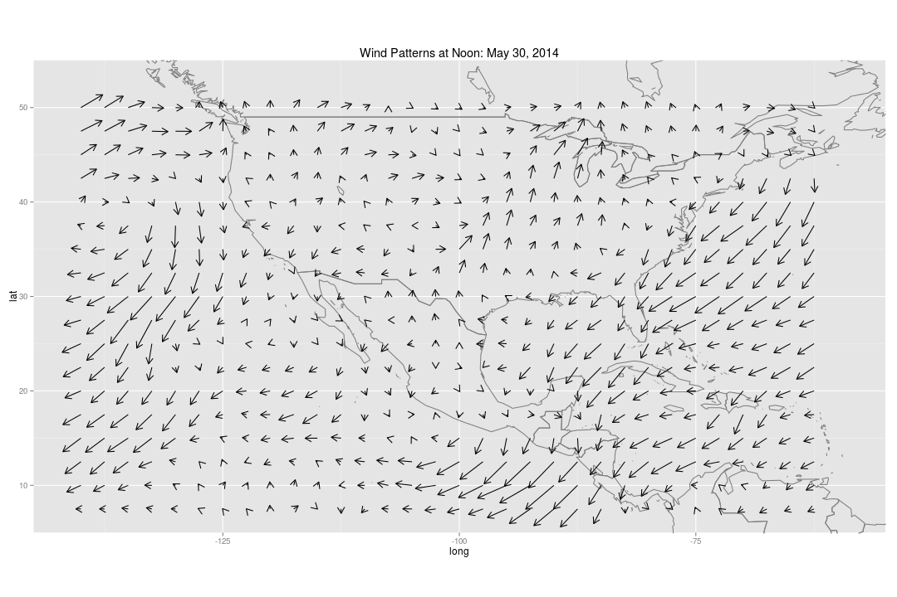 
</aside>

Do you see any differences? It may be easier to view them superimposed on top of each other.  Both time periods are stored in the object ``may2014_nov2013``.  Create a graph that shows both at the same time.

<aside>

```r
map.may2014_nov2013 <- ggplot(may2014_nov2013, aes(x = long, y = lat, color = factor(date))) +
  borders(database = "world") +
  geom_arrow(aes(length = speed*scaling, angle = angle)) +
  ggtitle("Wind Patterns at Noon") +
  coord_equal(xlim = longs, ylim = lats) +
  scale_color_manual(values = c("red", "blue")) 

map.may2014_nov2013
```

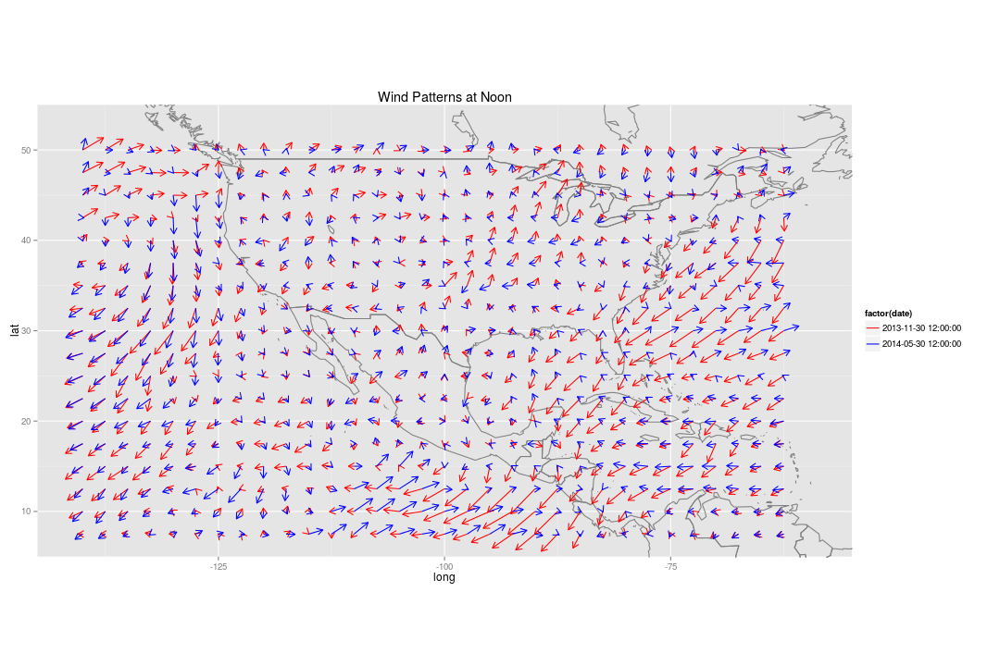 
</aside>

HINT: if you want to differentiate the two time periods, we can do this using color. The time period is in the variable `date`.  We want to treat this as a categorical variable (one category for each time period), and so in R we can convert a continuous variable to categorical using `factor()`.  So, you can just add `color = factor(date)` to the aesthetics (`aes`) in the `ggplot` command.

Unfortunately, the default colors will show up as red and green, which may not work if you have a red-green color deficit; you can force `ggplot` to use different colors using a command like `scale_color_manual(values = c("red", "blue"))` to use red and blue instead

## Comparing to May 30, 1949

Are differences over time only seasonal? Were wind patterns different at this same date and time 65 years ago?

These data are in the R object `may1949`.  Provide a plot of the wind direciton and speed from May, 1949, with an appropriate title.

<aside>

```r
ggplot(may1949, aes(x = long, y = lat)) +
  borders(database = "world") + 
  geom_arrow(aes(length = speed*scaling, angle = angle)) +
  coord_equal(xlim = longs, ylim = lats) +
  ggtitle("Wind Patterns at Noon: May 30, 1949")
```

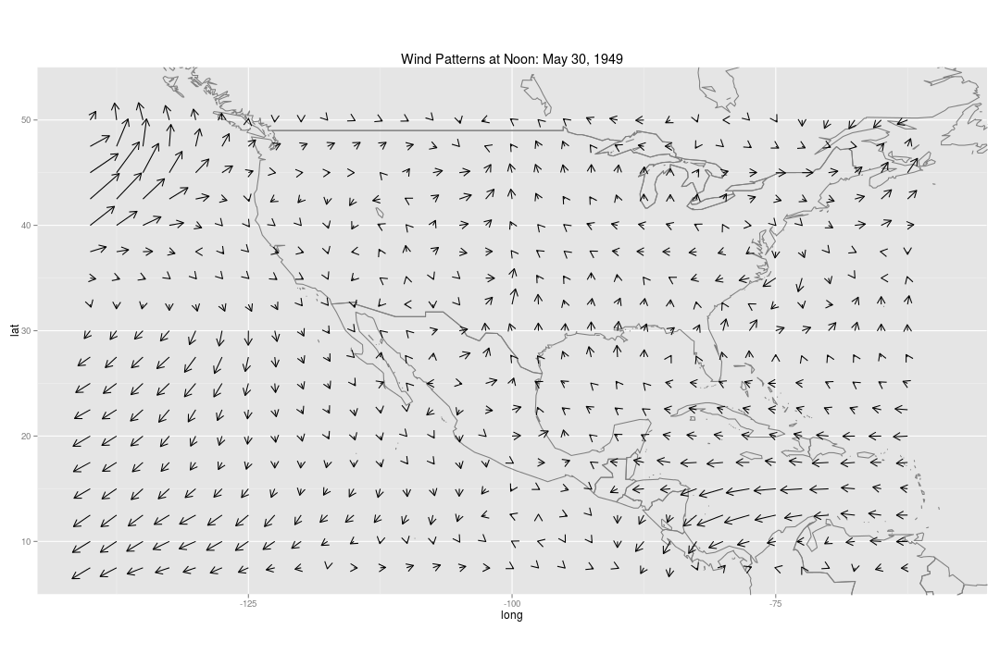 
</aside>

Data for both that time and May 2013 are in the object `may2014_1949`


```r
ggplot(may2014_1949, aes(x = long, y = lat, color = factor(date))) +
  borders(database = "world") +
  geom_arrow(aes(length = speed*scaling, angle = angle)) +
  ggtitle("Wind Patterns at Noon") +
  coord_equal(xlim = longs, ylim = lats) +
  scale_color_manual(values = c("red", "blue")) 
```

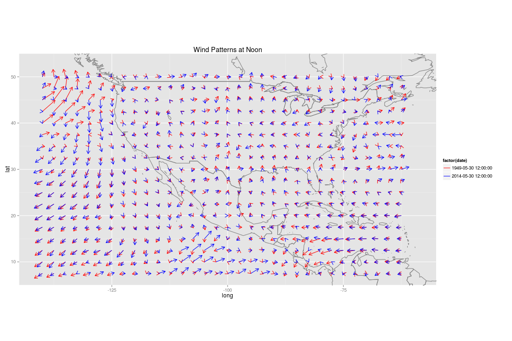 

Where is the wind blowing a different direction in 2014, compared to 1949?  Where is it blowing with a different strength?

# Looking at the same location over time

This gives us a rough sense of what could happen over time, but to get a better sense of this we can look at the *same* location over time.  We'll start with Warren, Wisconsin (45°N, 92.5°W), which is about 30 miles east of Saint Paul.

Let's look at wind speed, first, over time, from 1949 to the present, every 6 hours


```r
ggplot(warren_wi, aes(date, speed)) +
  geom_point() 
```

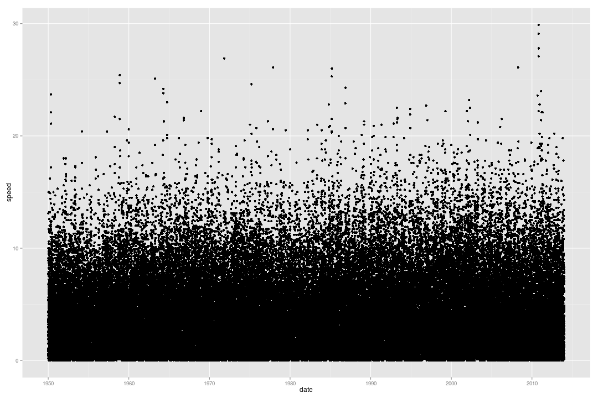 

What a mess!  We can see this a little better by making the points more transparent with the `alpha` argument:


```r
ggplot(warren_wi, aes(date, speed)) +
  geom_point(alpha = 0.05) + theme_bw()
```

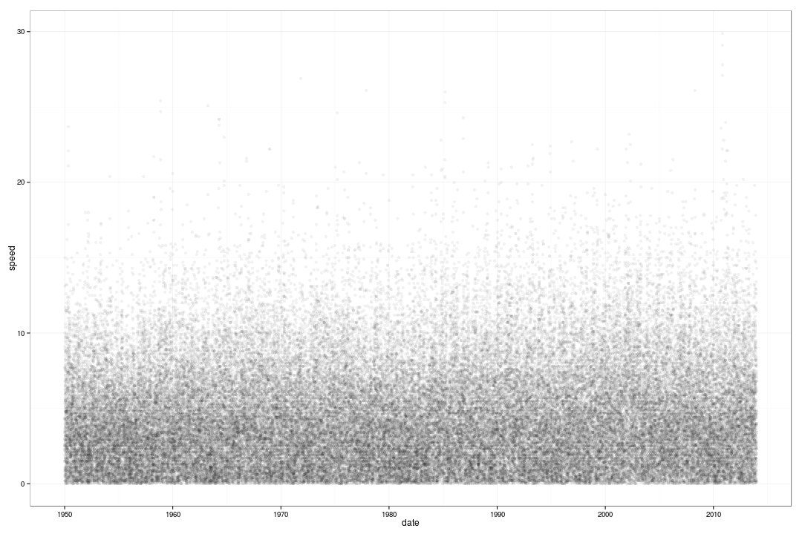 

Another strategy would be count the number of dots in each region to get a sense if there are any unusually common clusters:


```r
ggplot(warren_wi, aes(date, speed)) +
  stat_binhex()
```

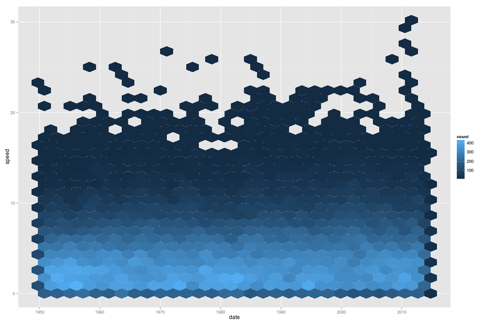 

Does it seem like there are average changes over time?

We can also use a similar strategy to look at wind direction (expressed as a number between 0 and 2 pi, i.e. radians)


```r
ggplot(warren_wi, aes(date, angle)) +
  geom_point(alpha = 0.1) +
  theme_bw()
```

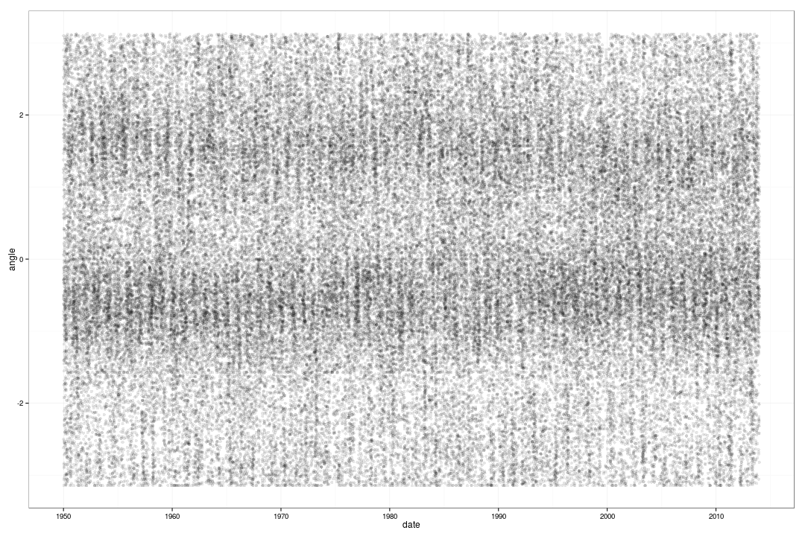 

```r
ggplot(warren_wi, aes(date, angle)) +
  stat_binhex()
```

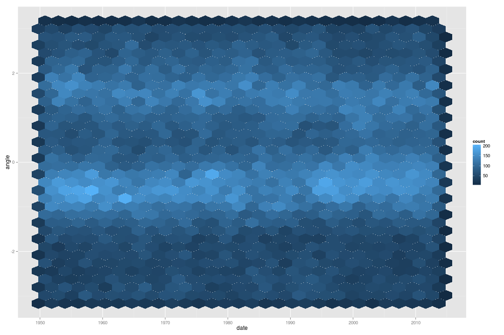 

We can combine wind, speed, and direction by looking at a "wind rose" plot, which shows the proportion of time that the wind is blowing in certain directions at certain speeds.  Here's a wind rose plot for Warren, WI from 1950 to 2013:


```r
windRose(warren_wi, ws = "speed", wd = "degrees",
         main = "Warren, WI Wind")
```

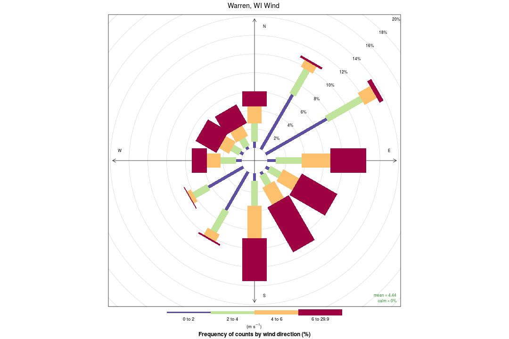 

We can look at this by month, or whether it was daylight, as well:


```r
windRose(warren_wi, ws = "speed", wd = "degrees", type = "month", main =  "Warren, WI Wind")
```

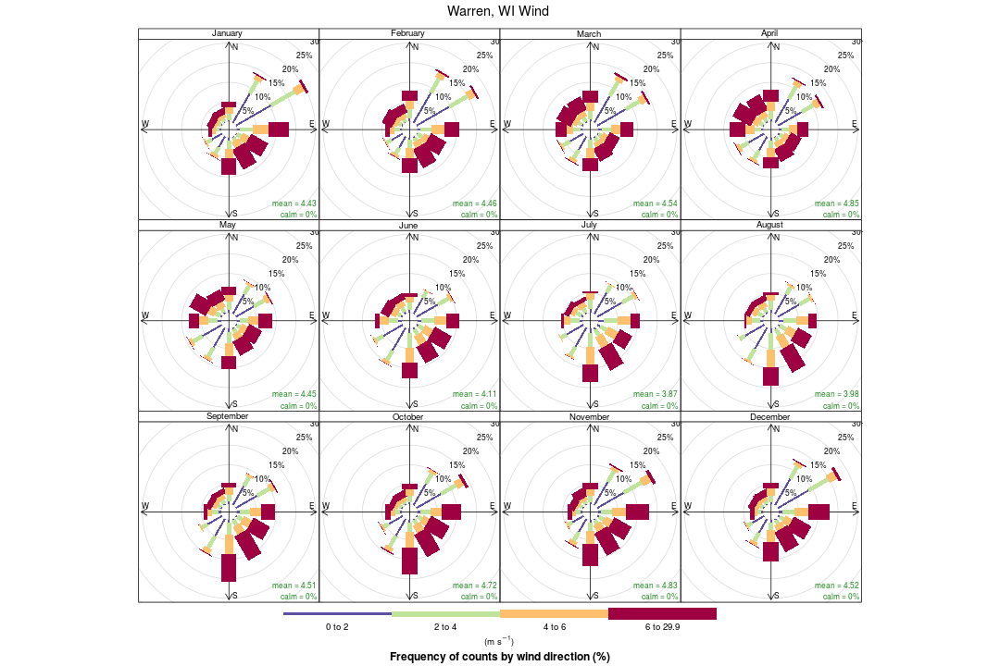 

```r
windRose(warren_wi, ws = "speed", wd = "degrees", type = "daylight", main =  "Warren, WI Wind")
```

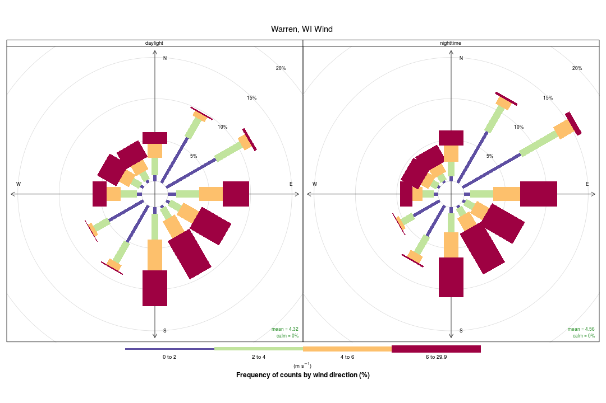 


Data was also gathered for the southernmost tip of Mexico, which is at the same longitude (15°N, 92.5°W):


```r
windRose(gulf, ws = "speed", wd = "degrees", main = "Wind Near Huixtla, Mexico")
```

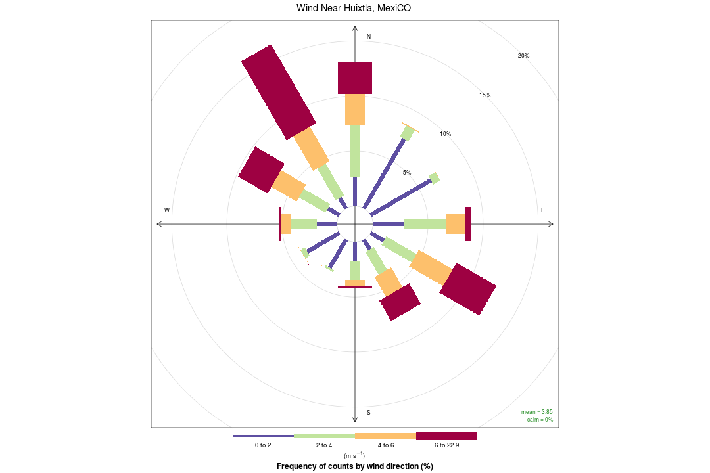 

Again, we can split by month or whether it was daylight:


```r
windRose(gulf, ws = "speed", wd = "degrees", type = "month", main = "Wind Near Huixtla, Mexico")
```

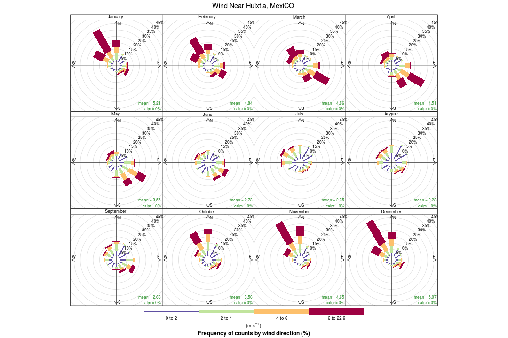 

```r
windRose(gulf, ws = "speed", wd = "degrees", type = "daylight", main = "Wind Near Huixtla, Mexico")
```

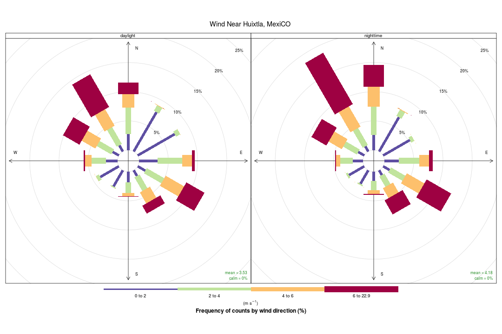 

