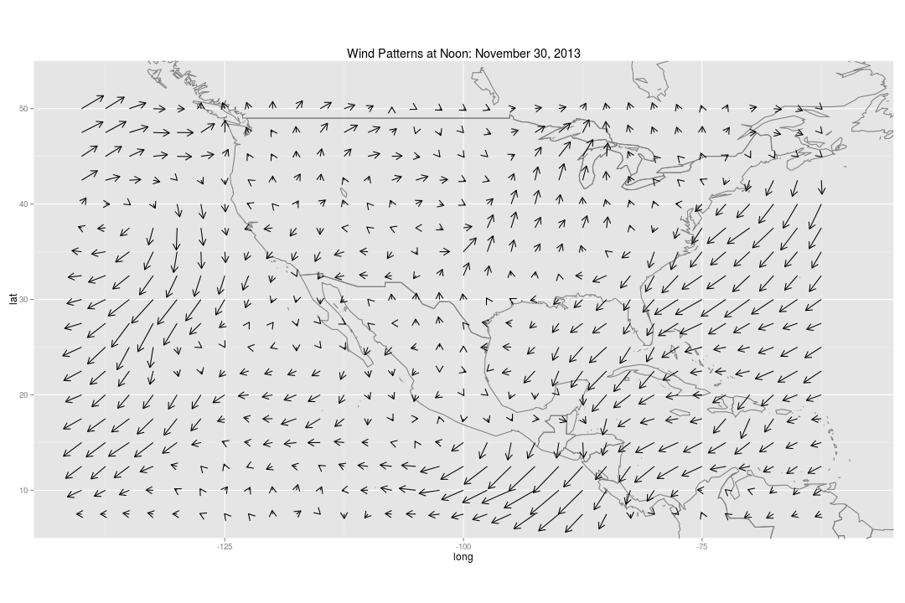
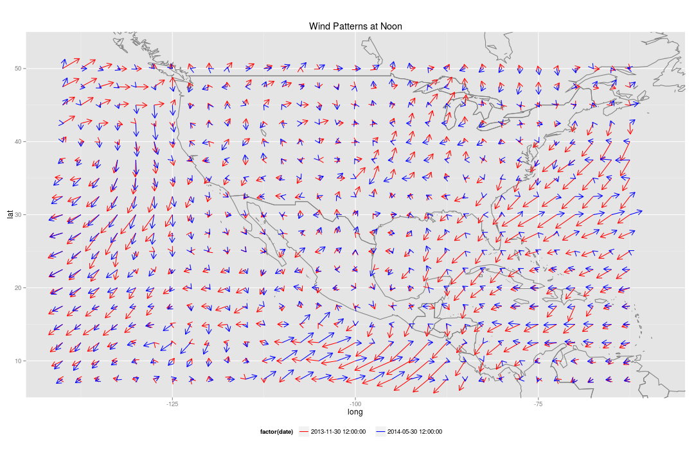
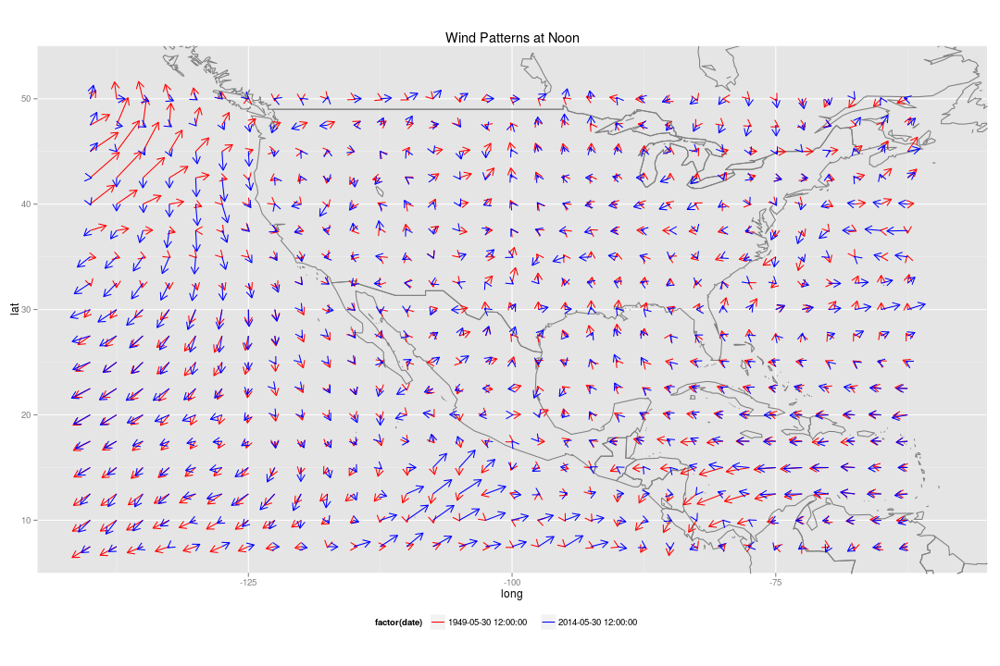
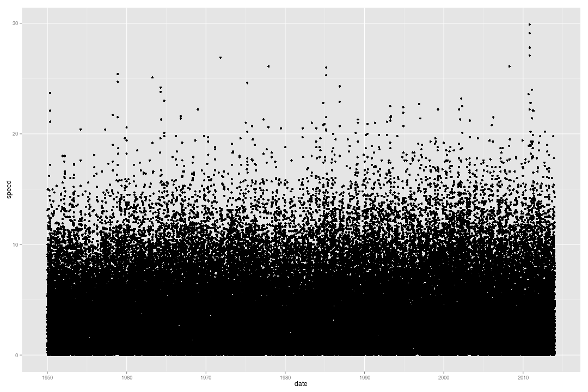
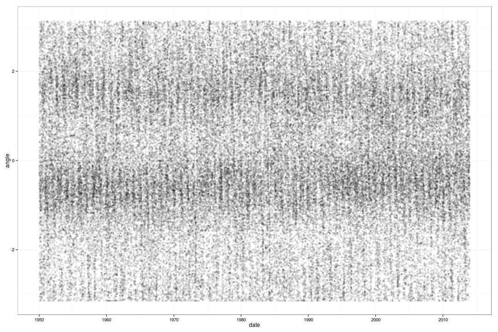
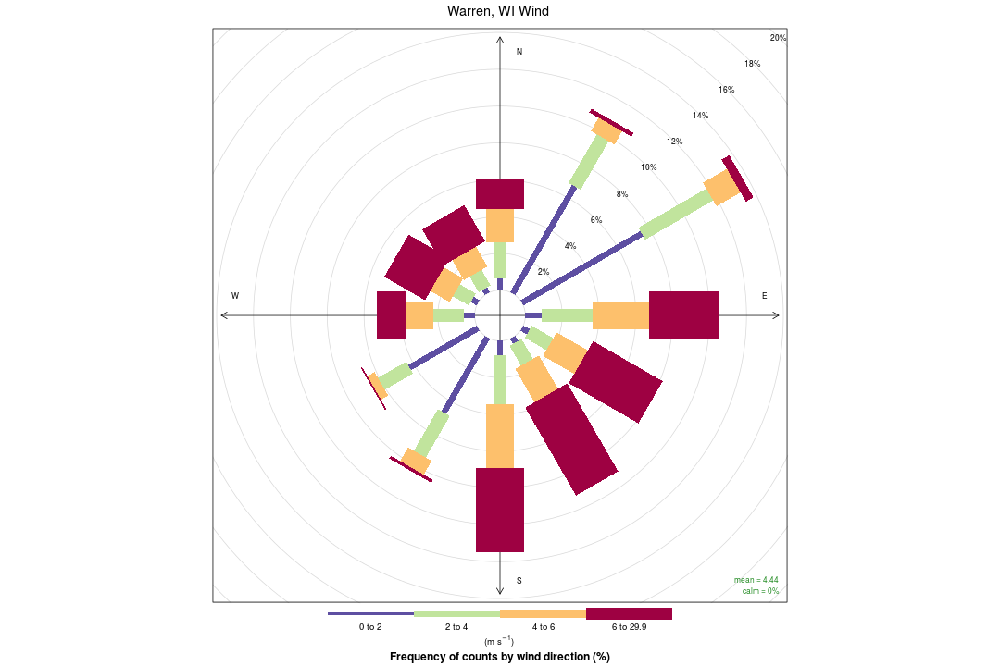
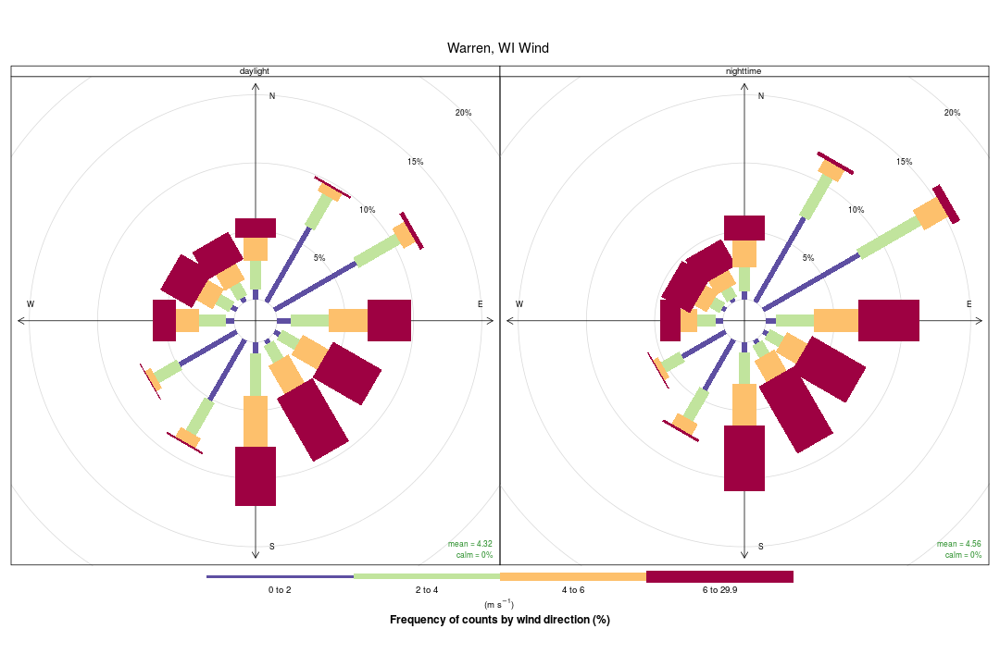
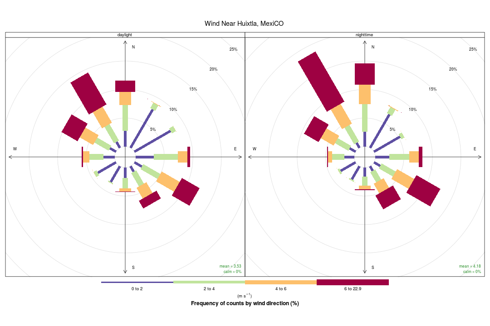

Viewing Wind Vectors of US, Mexico, and Central America
========================================================


```r
require(ggplot2)
require(grid)
require(openair)

load("data/wind-2014-1949-comparisons.Rda")
source("geom-arrow.R")
```

Wind consists of both *speed* and *direction*.  How can we visualize both of these elements on a map to get a sense of wind patterns?

One way of doing this is a *vector field*.  For each wind measurement, we plot an arrow that points in the direction that the wind is going, and with the length of the arrow corresponding to the speed.

Using this technique, we can visualize the region of US, Mexico, and Central America in May 31, 2014 at 12:00 noon:


```r
scaling <- 2.5/max(may2014$speed) # determines scale of arrows

## These cover continental US down to the top tip of South America
lats <- c(5, 55)
longs <- c(-145, -55)

map.may2014 <- ggplot(may2014, aes(x = long, y = lat)) +
  borders(database = "world") + 
  geom_arrow(aes(length = speed*scaling, angle = angle)) +
  coord_equal(xlim = longs, ylim = lats) +
  ggtitle("Wind Patterns at Noon: May 30, 2014")
map.may2014
```

 

What features do you notice?  Where are the fastest wind measurements?  Are their any prominent extended streams (a series of vectors that form a connected pathway)?

Of course, this is just one day.  How much changes in these patterns do we see over time?  Do spring and fall have similar or different wind patterns?  Would the same day of the year be pretty much the same year after year?

# Comparing to November 30, 2013

 Were wind patterns different at this same time 6 months before?


```r
map.nov2013 <- map.may2014 %+% nov2013 +
  ggtitle("Wind Patterns at Noon: November 30, 2013")

map.nov2013
```

 

Do you see any differences? It may be easier to view them superimposed on top of each other:


```r
map.may2014_nov2013 <- ggplot(may2014_nov2013, aes(x = long, y = lat, color = factor(date))) +
  borders(database = "world") +
  geom_arrow(aes(length = speed*scaling, angle = angle)) +
  ggtitle("Wind Patterns at Noon") +
  coord_equal(xlim = longs, ylim = lats) +
  scale_color_manual(values = c("red", "blue")) + 
  theme(legend.position = "bottom")

map.may2014_nov2013
```

 


# Comparing to May 30, 1949

Are differences over time only seasonal? Were wind patterns different at this same date and time 65 years ago?


```r
map.may1949 <- map.may2014 %+% may1949 +
  ggtitle("Wind Patterns at Noon: May 30, 1949")

map.may1949
```

 

Again, we can look at the two superimposed on top of each other:


```r
map.may2014_1949 <- map.may2014_nov2013 %+% may2014_1949

map.may2014_1949
```

 

Where is the wind blowing a different direction in 2014, compared to 1949?  Where is it blowing with a different strength?

# Looking at the same location over time

This gives us a rough sense of what could happen over time, but to get a better sense of this we can look at the *same* location over time.  We'll start with Warren, Wisconsin (45°N, 92.5°W), which is about 30 miles east of Saint Paul.

Let's look at wind speed, first, over time, from 1949 to the present, every 6 hours


```r
ggplot(warren_wi, aes(date, speed)) +
  geom_point() 
```

 

What a mess!  We can see this a little better by making the points more transparent with the `alpha` argument:


```r
ggplot(warren_wi, aes(date, speed)) +
  geom_point(alpha = 0.05) + theme_bw()
```

 

Another strategy would be count the number of dots in each region to get a sense if there are any unusually common clusters:


```r
ggplot(warren_wi, aes(date, speed)) +
  stat_binhex()
```

 

Does it seem like there are average changes over time?

We can also use a similar strategy to look at wind direction (expressed as a number between 0 and 2 pi, i.e. radians)


```r
ggplot(warren_wi, aes(date, angle)) +
  geom_point(alpha = 0.1) +
  theme_bw()
```

 

```r
ggplot(warren_wi, aes(date, angle)) +
  stat_binhex()
```

 

We can combine wind, speed, and direction by looking at a "wind rose" plot, which shows the proportion of time that the wind is blowing in certain directions at certain speeds.  Here's a wind rose plot for Warren, WI from 1950 to 2013:


```r
windRose(warren_wi, ws = "speed", wd = "degrees",
         main = "Warren, WI Wind")
```

 

We can look at this by month, or whether it was daylight, as well:


```r
windRose(warren_wi, ws = "speed", wd = "degrees", type = "month", main =  "Warren, WI Wind")
```

 

```r
windRose(warren_wi, ws = "speed", wd = "degrees", type = "daylight", main =  "Warren, WI Wind")
```

 


Data was also gathered for the southernmost tip of Mexico, which is at the same longitude (15°N, 92.5°W):


```r
windRose(gulf, ws = "speed", wd = "degrees", main = "Wind Near Huixtla, Mexico")
```

 

Again, we can split by month or whether it was daylight:


```r
windRose(gulf, ws = "speed", wd = "degrees", type = "month", main = "Wind Near Huixtla, Mexico")
```

 

```r
windRose(gulf, ws = "speed", wd = "degrees", type = "daylight", main = "Wind Near Huixtla, Mexico")
```

 

