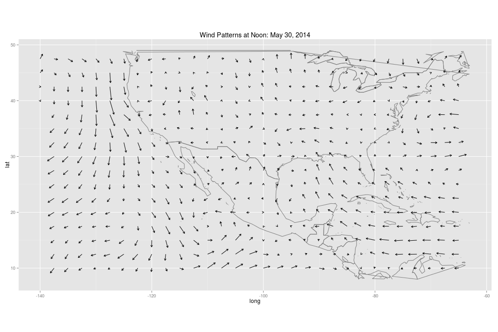
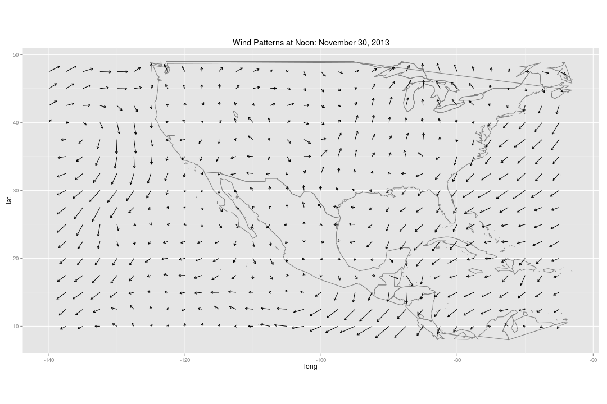
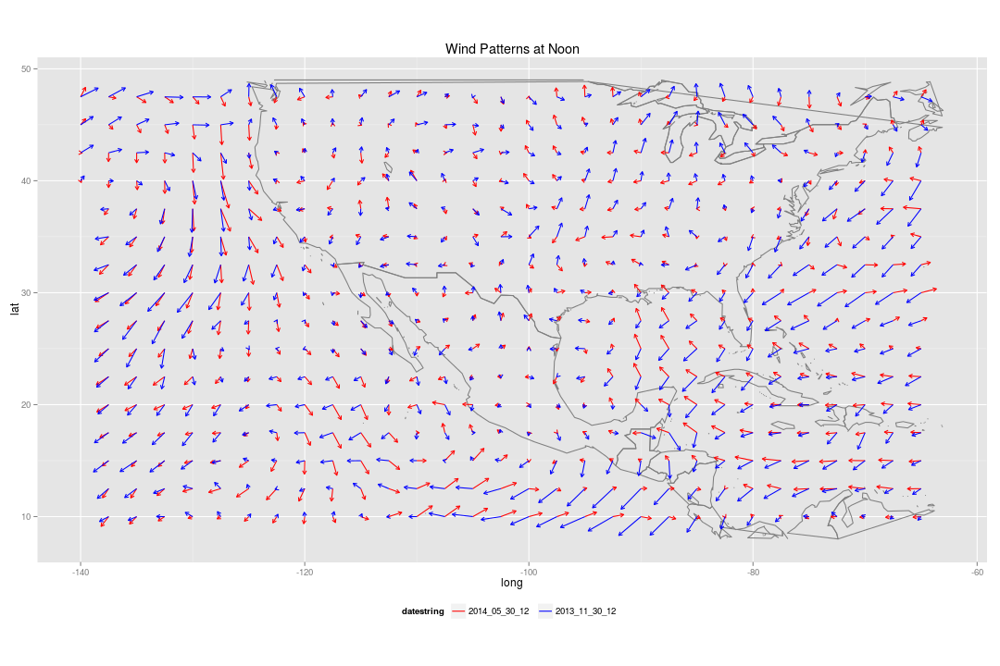
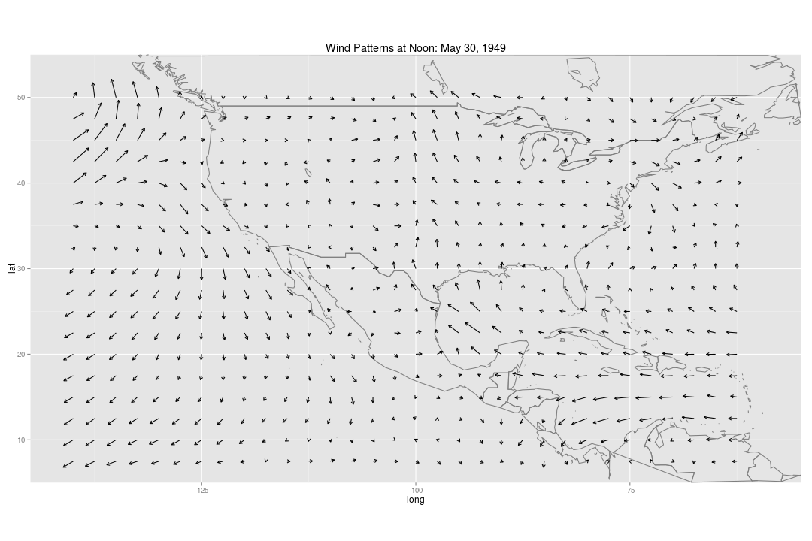
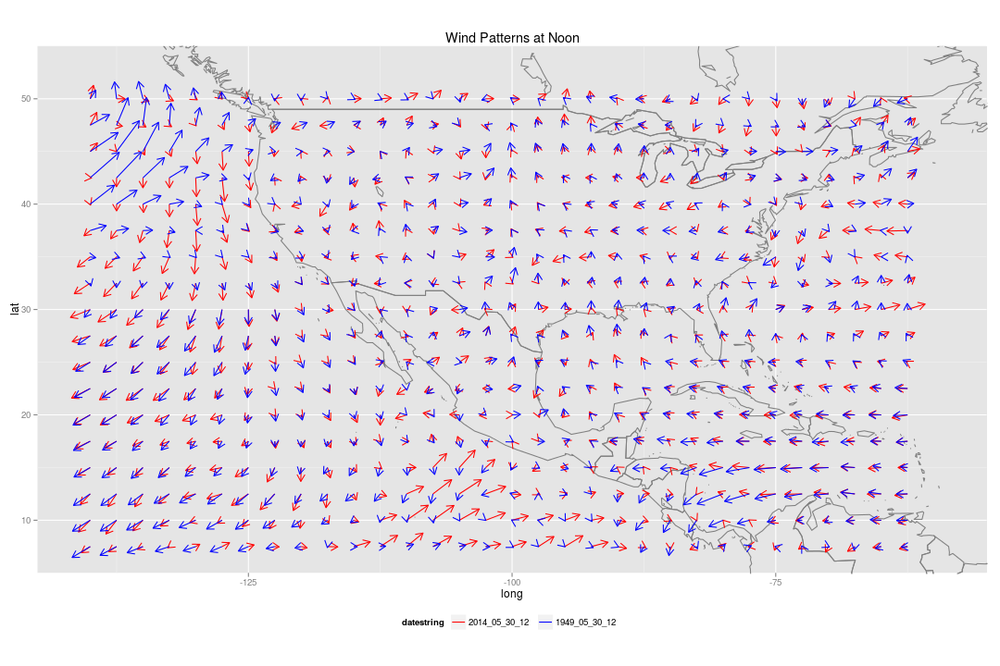

Viewing Wind Vectors of US, Mexico, and Central America
========================================================


```r
require(ggplot2)
require(grid)

setwd("CaseStudies/Wind-Vector/")
```

```
## Error: cannot change working directory
```

```r
load("data/wind-2014-1949-comparisons.Rda")
source("geom-arrow.R")
```

Wind consists of both *speed* and *direction*.  How can we visualize both of these elements on a map to get a sense of wind patterns?

One way of doing this is a *vector field*.  For each wind measurement, we plot an arrow that points in the direction that the wind is going, and with the length of the arrow corresponding to the speed.

Using this technique, we can visualize the region of US, Mexico, and Central America in May 31, 2014 at 12:00 noon:


```r
scaling <- 2.5/max(may2014$speed) # determines scale of arrows

## These cover continental US down to the top tip of South America
lats <- c(5, 55)
longs <- c(-145, -55)

map.may2014 <- ggplot(may2014, aes(x = long, y = lat)) +
  borders(database = "world") + 
  geom_arrow(aes(length = speed*scaling, angle = angle)) +
  coord_equal(xlim = longs, ylim = lats) +
  ggtitle("Wind Patterns at Noon: May 30, 2014")
map.may2014
```

 

What features do you notice?  Where are the fastest wind measurements?  Are their any prominent extended streams (a series of vectors that form a connected pathway)?

Of course, this is just one day.  How much changes in these patterns do we see over time?  Do spring and fall have similar or different wind patterns?  Would the same day of the year be pretty much the same year after year?

# Comparing to November 30, 2013

 Were wind patterns different at this same time 6 months before?


```r
map.nov2013 <- map.may2014 %+% nov2013 +
  ggtitle("Wind Patterns at Noon: November 30, 2013")

map.nov2013
```

 

Do you see any differences? It may be easier to view them superimposed on top of each other:


```r
map.may2014_nov2013 <- ggplot(may2014_nov2013, aes(x = long, y = lat, color = datestring)) +
  borders(database = "world") +
  geom_arrow(aes(length = speed*scaling, angle = angle)) +
  ggtitle("Wind Patterns at Noon") +
  coord_equal(xlim = longs, ylim = lats) +
  scale_color_manual(values = c("red", "blue")) + 
  theme(legend.position = "bottom")

map.may2014_nov2013
```

 


# Comparing to May 30, 1949

Are differences over time only seasonal? Were wind patterns different at this same date and time 65 years ago?


```r
map.may1949 <- map.may2014 %+% may1949 +
  ggtitle("Wind Patterns at Noon: May 30, 1949")

map.may1949
```

 

Again, we can look at the two superimposed on top of each other:


```r
map.may2014_1949 <- map.may2014_nov2013 %+% may2014_1949

map.may2014_1949
```

 

Where is the wind blowing a different direction in 2014, compared to 1949?  Where is it blowing with a different strength?


