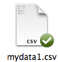
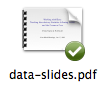
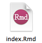
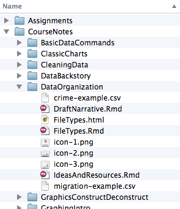
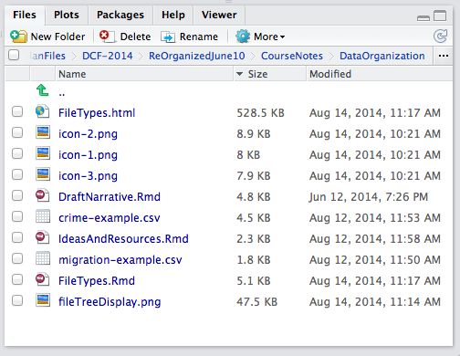
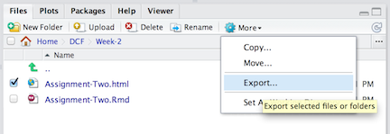

---
output:
  html_document:
    css: ~/KaplanFiles/DCF-2014/CSS/DCF-style.css
    fig_caption: yes
    toc: no
---

```{r child="/Users/kaplan/KaplanFiles/DCF-2014/CSS/DCF-common.Rmd"}
```

Video resources: [File paths](), [Embedding files](), [Creating an RMD file]()

## File Types, Data, and Documents

Most computer users are familiar with file icons that indicate which program will be used to open the file or which show a thumbnail of the contents of a file. For instance:    



In this course, you are going to be working with the *names* of files.  Why?  

* You are going to be providing links to files.
* You will use software to *compile* or translate one kind of file into another.
* You are going to be accessing files via their web Uniform Resource Locator (URL).

It will help if you can read and understand the names of files.

### Filenames

Here are some examples of file names: `employment.xlsx`, `HobbesEssay.docx`, `instructions.html`, `track2.mpeg`

Each of these consists of two parts:

1. The identifying or descriptive part of the name: "employment", "HobbesEssay", "instructions" or "track2" in the above examples.
#. The *filename extension*, which is one or more letters following the last period in the name: "xlsx", "docx", "html", "mpeg".  (Other widely used extensions are `.pdf`, `.zip`, `.png`, `.mpeg`.) These letters indicate the format of the file and often set which program will be used to open the file: a spreadsheet, a word processor, a browser, or a music player in the examples.  Or, in plainer language, the filename extension tells you the *kind* of file.

If you are looking at files through RStudio, the filename extension will always be displayed.  If you are using your your own computer's file browser, your system may have been set up to hide the extension.  Some instructions for changing this setting on the most common operating systems are here: [OS-X](http://support.apple.com/kb/PH10845), [Windows 7](http://windows.microsoft.com/en-us/windows/show-hide-file-name-extensions#show-hide-file-name-extensions=windows-7).

You will be working with several kinds of files.  Make sure you remember both the extension and the typical use of that kind of file.

* `.Rmd` stands for R/Markdown.  This is a document format. You will be creating such files using RStudio and writing the contents of reports and storing them on your computer so that you can revise them later, as needed.  These files display as simple, plain, unformatted text.  You will create, open, and revise such files with the RStudio editor.
* `.html` is the familiar kind of file used for readable content on the Internet.  These files generally display with section headers, images, links, and so on.  (Think of HTML as the equivalent of PDF.  PDF is used for documents formatted into pages, HTML is a scroll-type, interactive document.)

    You will **never** need to write HTML directly or to display it in an editor. (HTML can be very hard for people to read.  Here's an example, if you're curious: [CVC](https://github.com/dtkaplan/CVC/blob/gh-pages/Summer2014/outline2014.html).)  
    
    Instead of you writing HTML using the keyboard, RStudio will translate `.Rmd` files into HTML, at your command.
    
    You will use HTML files to:
    * look at the documents you write in a nicely formatted way, with images, links, etc.
    * hand in to complete your assignments.
    * publish to a blog or on the [rpubs](RPubs.com) distribution system.
  
    Again, you will **never** edit HTML files.
* `.csv` is a widely used spreadsheet format for storing data.  You may be familiar with spreadsheet files with a proprietary format, such as `.xlsx` for Microsoft Excel.
* `.Rda` (or `.Rdata`), a format for storing data and other information specifically for R.
* `.R`, a text format identifying the contents as software to be added to your R session.

## Creating an Rmd File

When doing an assignment, you will be creating an `.Rmd` file, compiling it to `.html`, and then handing in your assignment by uploading the HTML file to Moodle or RPubs. 

To create a new `.Rmd` file, open the "File/New File/R Markdown/From Template".  Choose the "BlankAssignment" template from the `DCF` package.  This will open a new document in the RStudio editor.  The document will be initialized with some contents.  You'll be adding on to these.

Save the `.Rmd` file in an appropriate place on your system.  It's up to you what you name the file, so long as it ends with the filename extension `.Rmd`. (RStudio will add this extension if you don't specify one.  To avoid mistakes, let RStudio do this work.) 

A recommendation: use the assignment number and your initials or name, e.g. `Assignment-One-BHO.Rmd`.  No spaces in the name, please. 

**Make sure** to follow the instructions in the template.  As you do your work, edit the `.Rmd` file that you saved; you don't need to get another template for that assignment. But you will need to use the template for each assignment.

## Paths: Files and URLs

### Files on Your System

A filename is analogous to a person's first name.  Just as first names are unique within a nuclear family, so filenames must be unique within a folder or directory.

You are probably used to seeing folders and the files they contain organized like this in the file browser on your computer:



The file *path* is the set of successive folders that bring you to the file.^[To run on with the family metaphor ...  You are identified within a household by your first name.  The path would tell you which specific nuclear family you belong to, perhaps in the form of your address, like this: *USA/Saint Paul/55105/703 Lincoln Avenue*.]

There is a standard format for file paths.  An example: `/Users/kaplan/Downloads/0021_001.pdf`.  Here the filename is `0021_001`, the filename extension is `.pdf`, and the file itself is in the `Downloads` folder contained in the `kaplan` folder, which is in turn contained in the `Users` folder.  The starting `/` means "on this computer".

The R `file.choose()` --- which should be used **only in the console**, not an Rmd file --- brings up an interactive file browser.  You can select a file with the browser.  The returned value will be a quoted character string with the path name.
```{r include=FALSE}
# Just to get things working neatly ...
file.choose <- function() "/Users/kaplan/Downloads/0021_001.pdf"
```

```{r}
file.choose() # then select a file
```

In RStudio, the FILES tab will display the path near the top:



#### Exporting Files

The files you create will be on your own computer system.  

If you are using RStudio Server in your web browser, remember that the "system" is another computer, somewhere in the cloud.  That's fine; it's safe there and you can get to it any time you need, and you can publish it directly to <rpubs.com>. But in order to upload the file to Moodle, you first need to *export* the file from the RStudio Server to the computer that the browser is running on.  To do this, go to the FILES tab, navigate to the appropriate folder, and check the little box for the file to upload.  This will almost always be an HTML file.  

Then select the MORE menu item, and export.  This will download the file to your browser and store it, typically in a "Downloads" folder.



If you are using the Desktop version of RStudio,^[You will know this because that version does **not** run in your browser.  To be using the Desktop version, you would have had to install the R and RStudio software on your own computer.] the files are already on your computer, ready for upload.

### URLs

You have probably noticed URLs in the locator window near the top of your browser.


A URL includes in its path name the location of the server on which the file is stored (e.g. `www.macalester.edu`) followed by the path to the file on that surver.  Here, the path is `/~montgomery` and the file is `graywolf.html`.

You will sometimes need to copy URLs into your work in R, to access a dataset, make a link to some reference, etc.  Remember to copy the entire URL, including the `http://` part if it is there.  For example, to include the jpeg picture of the gray wolf in your own Rmd file, use the following markup, which includes the URL.

    
    
Some common filename extensions for the sort of web resources you will be using:

* `.png` for pictures
* `.jpg` or `.jpeg` for photographs
* `.csv` or `.Rdata` for data files
* `.Rmd` for the human editable text of a document
* `.html` for web pages themselves

## Embedded Files within HTML Files

When you hand in documents for the course, you will almost always be handing in an HTML file.  However, it's very useful to be able to access the original Rmd file from which the HTML was compiled, or perhaps other files such as CSV data.

The `DCF` package provides a way to do this easily.  Inside an R chunk in the Rmd file, include the following command:

    includeSourceDocuments("AssignmentTwo.Rmd")
    
Of course, instead of always specifying `"AssignmentTwo.Rmd"`, give the quoted character string containing the path and filename for your Rmd file.  You can construct this easily by using `file.choose()` in the console, and copying the result as the argument of `includeSourceDocuments()` function.  This will embed the named file into your HTML, so that the file will be available directly through the HTML file.

```{r child="../../CSS/DisqusTemplate.Rmd"}
```
