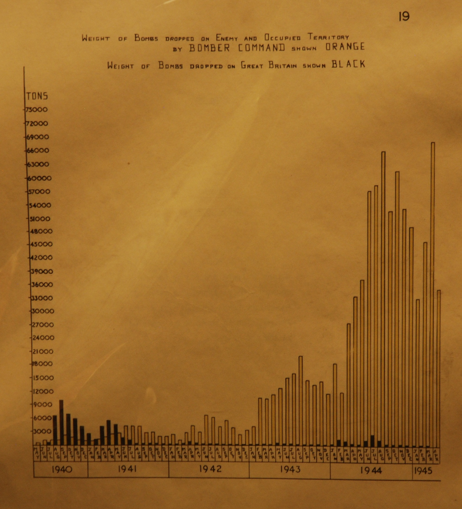
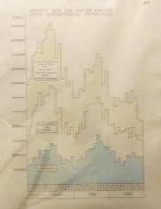
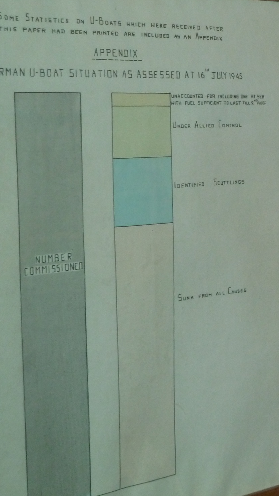
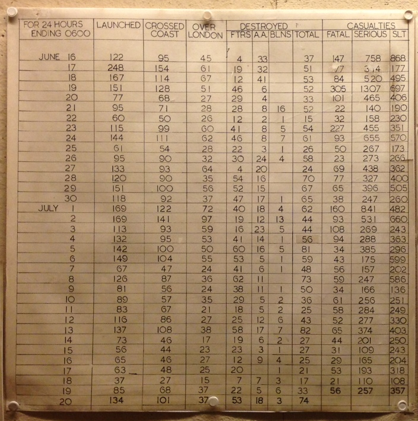

---
output:
  html_document:
    css: ~/KaplanFiles/DCF-2014/CSS/DCF-style.css
    fig_caption: yes
    toc: no
---

```{r child="/Users/kaplan/KaplanFiles/DCF-2014/CSS/DCF-common.Rmd"}
```

```{r include=FALSE}
source("makePalettes.R")
```

Although graphics are often decorative, the point of data graphics is to convey information, not to decorate.

These notes describe some general principles of informative data graphics, identifies some common obstacles in creating informative graphics, and suggests ways to overcome them.

## Principles

### Play to Perceptual Strengths

You're communicating with a human, so you have to work around the weaknesses of human perception and play to its strengths.

* Relative differences are easier to perceive than absolute 
* Nearby objects are easier to compare.
* Objects in the same context are easier to compare.

Here's a constructed optical illusion that illustrates one of the ways that we perceive things in a local context.  Are the two squares A and B the same shade of gray?  You can make a rapid judgment only by removing context that affects our visual judgment, for instance, overlaying a piece of opaque white paper with windows over A and B.


### Make Comparison Easy

One important use of graphics is to compare quantities.  It's easiest to compare when the things to be compared are nearby one another, and not separated by distracting intermediaries.

### Order Matters

Hand-in-hand with putting things to be compared nearby each other is the notion of order or sequence.  This is most powerfully represented by spatial position, but other graphical attributes can also set an order --- length, angle, size, "color." (That is, saturation and value, but not hue.  See below.).

### Work on a Budget

As a rule of thumb, you are limited to representing graphically just three ordered variables: two by (x,y)-position, one by size or color.  You can also add in a 4th variable, so long as it is categorical with just a few levels.

Choropleth maps, although pretty, are often out of place.  In a choropleth map, the x- and y-coordinates and size are consumed by the geography.  This leaves just one visual dimension to represent a quantity or category.  Unless the geography is essential, consider saving x and y to convey other information.

### Support Statistical Inference

Whenever you present an aggregate quantity, for instance, group means, add a component to your graphic showing the statistical uncertainty or spread of data around the aggregate.  This can be done by adding in the actual cases in the background or by showing confidence intervals or bands.

Compare: with clouds of points, mark specially the quantities you want compared.  Dynamite plot.


### Order in Colors

Colors that you use to compare quantities should appear ordered.

Perhaps the most widely used ordering scheme for colors is the rainbow, as described by the mnemonic ROYGBIV.  This order reflects the wavelength of light: short wavelength for violet, long wavelength for red.

Human perception, however, works differently.  The rainbow colors are not perceived as strongly ordered, which is perhaps why we need the mnemonic ROYGBIV to related the color to the physical quantity of wavelength.  To illustrate, glance at the following set of squares and see if you immediately know which color is at one extreme and which color is at the other extreme.

```{r fig.height=1.3, echo=FALSE}
showColorSquares( makeExampleData( n=7, seed=109 ), colFun=rainbow )
```

Now check your intuition.  Here are the same colored squares but with letters added to indicate the intended order:

```{r fig.height=1.3, echo=FALSE}
showColorSquares( makeExampleData( n=7, seed=109 ), 
                  letters=TRUE, 
                  colFun=rainbow )
```

A good way to think about color (for the purposes of selecting an ordered palette) is as three separate scales: hue, saturation, and value.  Many people find it intuitive to discern an order in saturation and value, but hue is unordered. To illustrate, here are three palettes along each of the scales. 

```{r echo=FALSE}
hue <- function( n, s=.75, v=.75, h=.75 ) 
  hsv( h=seq(0,n-1,length=n)/n, s=s, v=v )
value <- function( n, s=.1, v=.75, h=.5 ) 
  hsv( h=h, s=s, v=seq(0,n-1,length=n)/n )
saturation <- function( n, s=.75, v=.75, h=.75 ) 
  hsv( h=h, s=seq(0,n-1,length=n)/n, v=v )
```

#### Hue

```{r fig.height=1.3, echo=FALSE}
showColorSquares( makeExampleData( n=7 ), 
                  letters=FALSE, 
                  colFun=hue )
```

#### Saturation

```{r fig.height=1.3, echo=FALSE}
showColorSquares( makeExampleData( n=7 ), 
                  letters=FALSE, 
                  colFun=saturation )
```

#### Value

```{r fig.height=1.3, echo=FALSE}
showColorSquares( makeExampleData( n=7 ), 
                  letters=FALSE, 
                  colFun=value )
```

### A Quiz on Color Order

Here are three palettes, one based on hue, one on saturation, one on value.  The color squares have been shuffled differently in each palette.  For each palette, try to pick out the sequence of squares that would put them in color order.


```{r fig.height=1.3, echo=FALSE}
showColorSquares( makeExampleData( n=7, seed=110 ), 
                  letters=FALSE, 
                  colFun=saturation )
```

**Saturation**


```{r fig.height=1.3, echo=FALSE}
showColorSquares( makeExampleData( n=7, seed=111 ), 
                  letters=FALSE, 
                  colFun=hue )
```

**Hue**


```{r fig.height=1.3, echo=FALSE}
showColorSquares( makeExampleData( n=7, seed=112), 
                  letters=FALSE, 
                  colFun=value )
```

**Value**

The middle palette varies hue while keeping saturation and value constant.  Was it easier to see order in hue, or in saturation and value?

#### The Answers

```{r fig.height=1.3, echo=FALSE}
showColorSquares( makeExampleData( n=7, seed=110 ), 
                  letters=TRUE, 
                  colFun=saturation )
```

```{r fig.height=1.3, echo=FALSE}
showColorSquares( makeExampleData( n=7, seed=111 ), 
                  letters=TRUE, 
                  colFun=hue )
```

```{r fig.height=1.3, echo=FALSE}
showColorSquares( makeExampleData( n=7, seed=112), 
                  letters=TRUE, 
                  colFun=value )
```

#### Example Palettes

The following are palettes from [ColorBrewer2.org](ColorBrewer2.org).  There are three major categories --- sequential, diverging, and categorical^[The term "qualitative" is sometimes used instead of "categorical.]  The most important choice is that of the category.  Within a category, selection of a palette is largely a matter of taste.  Given that about 8% of males and 0.5% of females in the US have some form of color blindness, it can be important to choose a palette that is well perceived by the colorblind.^[In terms of the names shown below for palettes, the colorblind suitable palettes are these: Diverging --- BrBG, PiYG, PRGn, PuOr, RdBu, RdYlBu; Categorical --- Dark2, Paired, Set2; Sequential: any.] Other potentially important issues include whether the palette is well represented in printed form, on an LCD screen, or can be photocopied well.  The <ColorBrewer2.org> site gives information about all of these qualities.

These palettes are readily available in R^[`ggplot2` knows about these palettes, by name.  If you're not using `ggplot2` graphics, see the `RColorBrewer` package.].

##### Sequential Palettes

When you want to use colors to represent numerical values, or ordered categorical values, a sequential palette is a good choice, particularly those palettes that keep hue constant.

```{r echo=FALSE}
display.brewer.all( type="seq")
```


##### Diverging Palettes

Sometimes you will want to indicate clearly an important "central" value with cases being on either side of this.  For instance, zero is an appropriate value when comparing positive and negative values.  The mean value is often appropiate to use as the central value.

These are diverging color palettes^[From <colorbrewer2.org> and the RColorBrewer package.]. In each, a neutral color, e.g. white, is at the center.  The name given can be used directly in `scale_color_brewer()` as the `palette=` argument.

```{r echo=FALSE}
display.brewer.all(type="div")
```

##### Palettes for contrasting

When using color to represent an unordered, categorical variable, avoid palettes that suggest an order.  Since hue is perceived as unordered, palettes with a range of hues but constant luminance and chrominance are appropriate.

```{r echo=FALSE}
display.brewer.all( type="qual")
```


### Contrast vs Compare

### Support Inference

## Problems

### Too Wide a Spread?

Log axes

discretization, 
e.g. ntiles
logarithmic cut points.

### Too Many Cases?

transparency

density

### Points lie over one another?

`jitter()`

### Too Many Variables?

### Too Much Data?

Redo this plot with the entire NHANES data:
```{r echo=FALSE}
Small <- sample_n( NHANES, size=2000 )
ggplot(data=Small,aes(x=age,y=height))+geom_point()+aes(colour=sex)
```

Use this to talk about overplotting and `alpha=`.


## Log Axes

charges for different DRG in MedicareCharges data as in GraphicsCommands.Rmd.  Use log charges to show proportional differences.

## Show the data!

* Dynamite plots: why they are bad and how you can do better.  Bars are good when you want to emphasize positive versus negative.  Including 0 in the plot is enough to show position.

## Jitter and alpha

See the weight example.

## Continuous or discrete

Conversion of quantitative to categorical.

## Example: Blood pressure and diabetes

The NHANES data gives ... for 31000 people.  Suppose you are interested in the question, does waist to height ratio differ between diabetics and non-diabetics.

```{r}
group_by(NHANES, sex, diabetic) %>% 
  summarise(myIndex=mean(waist/height,na.rm=TRUE),n=n(),
            se=sd(waist/height, na.rm=TRUE)/sqrt(n)) -> foo 
ggplot(foo, aes(x=sex, group=diabetic, color=diabetic,y=myIndex,width=.5))  + geom_bar(alpha=.3,aes(fill=diabetic),position='dodge',stat='identity') + geom_errorbar(aes(ymax=myIndex+2*se,ymin=myIndex-2*se,),position='dodge',weight=3,size=2)  + ylim(0,80)
```

Perhaps a better plot would be:

```{r eval=FALSE}
ggplot(NHANES, aes(x=sex, y=myIndex, fill=diabetic)) + geom_boxplot(notch=TRUE)
```

NB.  For some reason, geom_box() doesn't use group.  But color works.


MAYBE ALWAYS DO A SELECT to highlight the variables being used.

## Exercises

What could you improve about this graphic if your point is to show that pulse pressure differs from diabetics and non-diabetics?  Hint: Missing data is shown in gray, even though it isn't in the legend.

```{r eval=FALSE}
group_by(NHANES, sex, diabetic) %>% 
  summarise(mn=mean(myIndex,na.rm=TRUE),n=n(),
                                              se=sd(myIndex, na.rm=TRUE)/sqrt(n)) -> foo 
ggplot(foo, aes(group=sex, x=diabetic, y=mn,width=.5))  + geom_bar(alpha=.3,aes(fill=sex),position='dodge',stat='identity') + geom_errorbar(aes(ymax=mn+2*se,ymin=mn-2*se,),position='dodge',weight=3,size=2)  + ylim(0,80) + ylab("Waist to Height Ratio (cm/m)") + 
  xlab("Diabetes status")
```


## Churchill War Rooms

* Tons of bombs in World War II. <http://www.peacockworks.com/wp-content/uploads/2012/12/Bombs-in-Weight-Dropped-in-WW2.jpg> 




* Disposition of German submarines at end of war.

 [Source](http://blog.revolutionanalytics.com/2011/06/ww2-dataviz.html)

 [Source](http://blog.revolutionanalytics.com/2011/06/ww2-dataviz.html)

* Flying bomb stats.  Source: DTK July 2014



## FOR GRAPHICAL DECISIONS

Redo the NHANES mortality as a logistic regression.


Show fraction alive as a function of sex and smoking status.

Show proportion in each age of the height ntiles.  Stack them. 

(Some color palettes](xhttp://learnr.wordpress.com/2009/04/15/ggplot2-qualitative-colour-palettes/)


## Tuning up graphics

* Labels with `xlab()` and `ylab()`
* Setting the x-y scale by hand.
* Removing xxtraneous factors: use `droplevels()` to drop unpopulated levels
* Setting the overall style, e.g. Economist, NYT, 


```{r child="../../CSS/DisqusTemplate.Rmd"}
```


