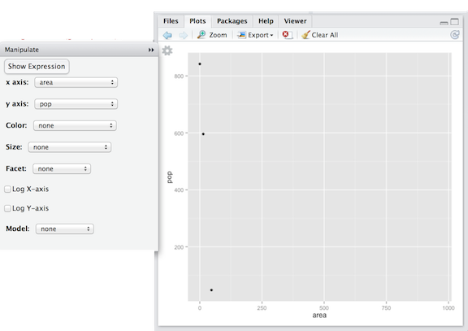
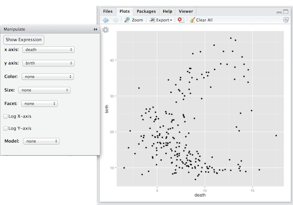
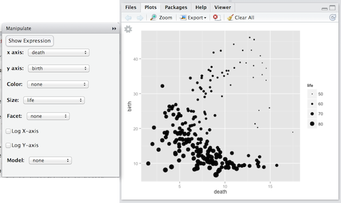

---
output:
  html_document:
    css: ~/KaplanFiles/DCF-2014/CSS/DCF-style.css
    fig_caption: yes
    toc: yes
---

```{r child="/Users/kaplan/KaplanFiles/DCF-2014/CSS/DCF-common.Rmd"}
```

```{r}
forDraft <- function( .data, size=2000, seed=6723 ) {
  ncases <- nrow( .data )
  size <- min( size, ncases )
  originalSeed <- .Random.seed
  on.exit( set.seed( originalSeed ))
  set.seed( seed )
  sample_n( .data, size=size )
}
```


## Making Data Graphics: Introduction

Data verbs are used for transfiguring data tables.  To make graphics, you'll use plotting software.  The basic pattern to make graphics is very simple:

* Create a data table whose cases you want to display. Almost always you will construct the graphic from just **one** data table.
1. Select a graphing modality that you think is appropriate.
#. Construct the graphics by assigning variables within the data table to the graphical attributes (or "aesthetics") for the selected modality. Such assignment is called "mapping" the variables onto the attributes.^[The word "mapping" here refers to a mathematical concept: assigning an output for each input.  In contrast, the everyday word "mapping" refers to an action which might better be called "cartography."]

These notes show examples for four graphics modalities:

* Scatterplots
* Bar Charts
* Maps
* Networks

## Graphics Software

The process of constructing a graphic is remarkably simple.  Remember: once you have the data table, you need only choose the modality and decide which variables will be mapped to which graphical attributes.  Those are choices you make.  The software takes care of constructing the frame, glyphs, and scales.

Later on, you'll see how to put together R statements that give you tremendous flexibility and choice in constructing graphics.  For now, however, you will use simple programs that let you map variables to attributes interactively.

## Scatter Plots

Consider the country-by-country data in `CountryData`.  
```{r}
data( "CountryData" )
```

It's a good practice to look at the documentation of the data so you know what the cases are and what the variables mean.  `CountryData` is part of the `DCF` package, so you can see documentation with `help()`.
```{r eval=FALSE}
help( "CountryData" )
```

Consider the relationship between birth rate and death rate among the countries.  There are variables `birth` and `death` that give these rates (in #/1000 per year).

An appropriate graphic modality is a scatter plot: birth rate against death rate.  To make the graph, use the software appropriate for this modality, namely `mScatter()`.  As an argument, give the data table from which the variables are taken: `CountryData`.

```{r eval=FALSE}
mScatter( CountryData )
```

That one simple command gives two essential details: what data table to use and what modality of graph to make.  After giving that command, something like the following should appear in your "Plots" tab.

<div class="figure">

<p class="caption">The `mscatter()` function lets you select which variables are mapped to which graphical attributes.  Always, each case corresponds to a single glyph in the graph.
</p></div>

Notice three components of the result:

1. A coordinate grid with dots.
#. A menu for mapping variables to attributes.
#. A small gear icon 

If you don't see the menu on your system, click on the gear icon.  If the menu runs off the bottom of the screen, make the "Plots" tab taller.

By default, the first two quantitative variables, `area` and `pop`, are being used to define the frame.

Using the menu, set the frame to be `birth` versus `death`.  (Remember, the convention is "y versus x.")

<div class="figure">

<p class="caption">
The variable `birth` has been mapped to the y-axis location.  `death` has been mapped to the x-axis.
</p></div>

The overall pattern: countries with high death rates have either very high birth rates or very low birth rates.  Why?  Perhaps the low-birth rate countries are those with older populations, and the high-birth rate countries have younger populations.

The glyphs in scatterplots --- dots here --- can have graphical attributes besides from their position in the frame.  Standard ones include fill color, shape, size, transparency, and border color. For example, here life expectancy (in years) is mapped to size. You can see that countries with low birth rates tend to have high life expectancies.

<div class="figure">

<p class="caption">
Graphical attributes such as size, shape, and color can be used to represent additional variables.  Here, dot size reflects a country's life expectancy.
</p></div>

Being able rapidly to try different arrangements of variables can help you develop graphics for exploring relationships, as well as conveying the message you want the graphic to tell.

Even though it's straightforward to represent a data table as graphics, getting to a glyph-ready data table is part of the work.  For instance, suppose you want to look at the relative number of male and female births over time.  The `BabyNames` data contains this information implicitly.  Before the information can be graphed, you need to transform the existing data table to one in the right form.  The `BabyNames` data comes in this form:

```{r echo=FALSE,results='asis'}
data( "BabyNames" )
BabyNames %>% 
  filter( year %in% c(1990,2010)) %>%
  sample_n( 6 ) %>%
  arrange( year ) %>%
  xtable( )
```

To plot out the total number of births each year, `BabyNames` needs to be transfigured to present the sum of `count` for each sex in each year.  Here's one way to do this.

```{r}
YearlyBirths <- 
  BabyNames %>%
  group_by( year, sex ) %>%
  summarise( births=sum(count))
```

```{r echo=FALSE,results='asis'}
YearlyBirths %>% 
  filter(year %in% c(1990,2000,2010)) %>%
  xtable()
```

Although `BabyNames` is not glyph-ready for the purposes of showing yearly births, the `YearlyBirths` table is.  In case you're wondering, here's the pattern of births over time as a scatterplot.^[Rather than using dots for glyphs, it's more effective for time series like this to connect the dots with short line segments.  That's called a line plot. You'll see how to make them when you use the detailed R graphics commands.]

```{r echo=FALSE}
ggplot(data=YearlyBirths,aes(x=year,y=births))+geom_point()+aes(colour=sex)
```

## Bar Plots

Bar charts use a glyph whose *length* reflects the value to be presented.  Depending on how variables are mapped to graphical attributes, the plots can tell different aspects of the story.

For instance, the individual ballot choices in the 2013 mayoral election in Minneapolis look like this.

```{r echo=FALSE,results='asis'}
data( "Minneapolis2013" )
Minneapolis2013 %>% 
  sample_n( 6 ) %>%
  xtable( )
```

There are more than 80,000 cases in the file.  It's likely that you would want to create a glyph-ready file that's a summary of the individual ballots.  For instance, suppose you tally up the number of 1st choice votes made for each candidate.

```{r}
data( "Minneapolis2013" )
FirstPlaceTally <-
  Minneapolis2013 %>%
  group_by( First ) %>%
  summarise( total=n() )
```

There were 37 candidates in the election (!).  The first part of `FirstPlaceTally` looks like this:
```{r echo=FALSE,results='asis'}
head(FirstPlaceTally) %>% xtable()
```

Betsy Hodges is the only major candidate of those shown here.

The results can be displayed effectively with a bar chart.  Make this with 
```{r eval=FALSE}
mBar( FirstPlaceTally )
```

```{r echo=FALSE}
ggplot(data=FirstPlaceTally,aes(x=reorder(First,-total),y=total ))+geom_bar(stat='identity',position=position_stack(width=.9)) + theme(axis.text.x=element_text(angle=60,hjust=1)) + xlab("Candidate")
```

The chart shows at a glance that there are just a handful of major candidates.  For this plot, the `total` variable was mapped to the y-axis, the candidate was mapped to the x-axis, and the candidates were ordered from highest total to lowest.  Look closely and you'll see that "undervote" (meaning no candidate was chosen) beat 29 of the candidates.

Another useful aspect of bar charts is splitting the bar according to some variables.  To illustrate, here are the precinct-by-precinct totals for the major candidates. Spliting a bar into 37 subcategories is overwhelming, so just the major candidates are shown.  You don't yet know the data verbs for constructing the data table that's needed, so the following set of expressions will be mysterious. But you might recognize a couple of the verbs.

```{r echo=FALSE,warning=FALSE}
ByPrecinct <-
  FirstPlaceTally %>% 
  filter(total > 5000) %>% # Just the big candidates.
  inner_join( Minneapolis2013, . ) %>%
  group_by( Precinct, First) %>% 
  summarise( total=n() ) %>%
  mutate( First=droplevels(First) )
```

```{r echo=FALSE}
ggplot(data=ByPrecinct,aes(x=Precinct,y=total ,fill=First))+geom_bar(stat='identity',position=position_dodge(width=.9)) + theme(axis.text.x=element_text(angle=60,hjust=1)) 
```

In this bar chart, the categories on the x-axis are the precincts.  Within each precinct, bars are drawn for the subcategory of candidate.

From such a plot, it's easy to see that Betsy Hodges was the winner in almost all of the precincts.

Another common arrangement of the subcategories is "stacking," like this:

```{r echo=FALSE}
ggplot(data=ByPrecinct,aes(x=reorder(Precinct,-total),y=total ,fill=First))+geom_bar(stat='identity',position=position_stack(width=.9)) + theme(axis.text.x=element_text(angle=60,hjust=1)) + ylab("Precinct")
```
This presentation emphasizes different aspects of the data than the side-by-side (or "dodged") barchart.  For instance, it's easy to see how vote totals differed from precinct to precinct and that Cam Winton and Don Samuels had adherents in almost all of the precincts.


* Bar plots: Minneapolis Mayor

* Maps: CIA data, weather events

* Networks: Minneapolis Mayor


Steps:

1. Choose a modality: `scatter()`, `density()`, `barplot()`, `network()`.
2. Choose the variable that corresponds to each aspect of the plot.
3. Cut and paste the command into your report.

These functions just construct graphics.  The data already need to be in a form where there is a variable for each aspect being used, e.g. an x- and y-variable for a scatter plot.

