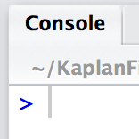
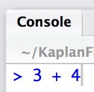
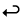
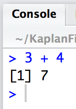
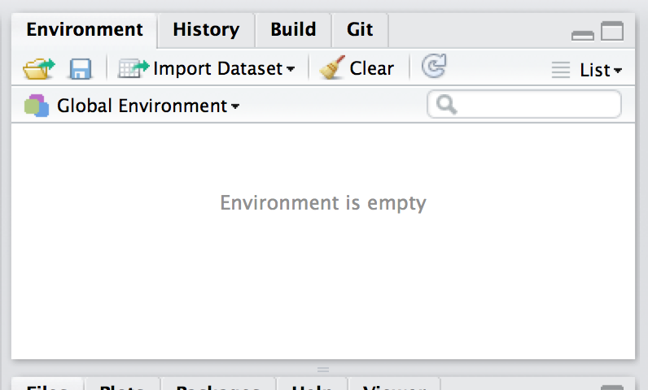
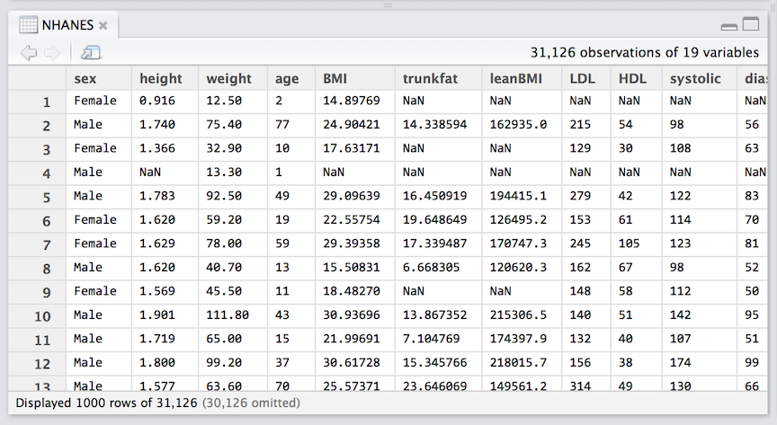
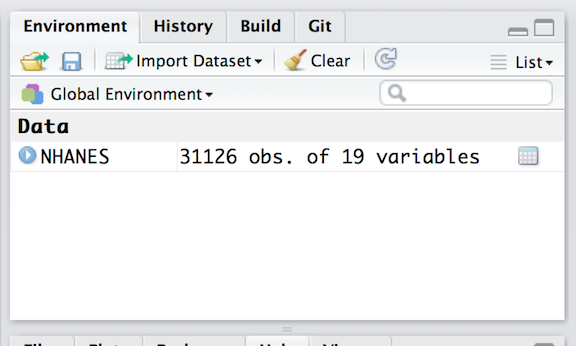
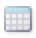
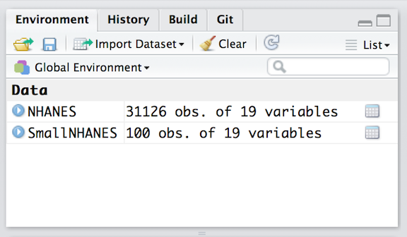

```{r include=FALSE}
require(knitr)
require(DCF)
require(NHANES)
opts_chunk$set( comment = NA )
```

This tutorial will get you started using R commands and introduce you to basic concepts involving commands.

As you read this document, try out the commands shown.  You don't need to go beyond these simple commands yet.


### Commands and the Console

To start, you will enter R commands into the *console*.  Let's go ...

Find the console pane in RStudio and the prompt, `>`.



Click the cursor in the console pane so that anything you type shows up there.  Type this simple command: 



After you press *enter*, , R will *execute* your command and print out a response:



Notice that after the response, there is another prompt.  You're ready to go again!

#### Practice

Enter each of these arithmetic commands, one at a time:
```{r results='hide'}
16 * 9
sqrt(2)
20 / 5
18.5 - 7.21
```

### Sessions

Your work in R occurs in *sessions*.  A session is a king of ongoing dialog with the R system.  

A new session is begun every time you start RStudio.  The session is terminated only when you close or *quit* the RStudio program.  If you are using RStudio inside your browser,  the R session will be maintained for days or weeks or months, and will be retained even when you login to the server from a different computer.

When a session is first started, it is in an empty environment.  You can see this in the *Environment* tab:



As you use R, you will be creating objects in the session environment.

### Loading Packages

R has grown in use rapidly, in part because it's easy to add new software and new capabilities to R.  Such additions are called *packages*.  Indeed, some of the central functionality of R is provided by packages.

We're going to use several packages.  The `DCF` package contains data for the Data & Computing Fundamentals course.  In order to make these data accessible, you have to *load* the package.  The command is:
```{r}
library( DCF )
```
Usually you will give this command at the start of a session.

The `NHANES` package^[`NHANES` was originally created for the Data & Computing Fundamentals course, but is now distributed through the official R archive network so that it can be used more widely.] contains (as of this writing) just one data table, which is also called `NHANES`.

##### Did something go wrong?

In response to the above command, you might get a response from R like this:
    
        Error in library(DCF) : there is no package called ‘DCF’

If this happens, it means only that your R account is not up to date with the `DCF` package.  To fix things, use these commands (cut and paste them verbatim from this document into your R console.)
    
```{r eval=FALSE}
install.packages( "devtools" )
devtools::install_github( "dtkaplan/DCFdevel" )
```

Then try again with `library(DCF)`.


### Data and Objects

The data you work with will generally be organized into *data tables*. To work on data in R, you need to bring the data into your R session. There are many ways to do this.  The simplest, and the one we will use in this introduction, is via the `data()` function.

You can list the data in a package with this command:
```{r}
data( package = "DCF" )
```
Give the command.

To bring a particular data table into R, use the `data()` function with the name of the data table, as in:
```{r}
data( "NHANES" )
```

This will bring a copy of the data into the session environment.  To take a peak at the data, use
```{r results="hide",eval=FALSE}
View( NHANES )
```




Another way to get information about the data is to click on the expand icon  next to the NHANES listing in the environment tab.



You can look at the data table more closely by clicking on the small spreadsheet icon: .

Finally, for data tables contained in a package, you can get a narrative description using the `help()` command:

```{r}
help( "NHANES" )
```

If you haven't already done so, go back to the beginning and type each command into the R console, find the environment tab, and press the spreadsheet and summary icons  & .

### Functions, commands, arguments, and objects

The above examples illustrate many of the most important components needed to use R.  Giving these components names will help in communicating about using R.

#### Functions

A *function* is a way to carry out some operation. They take one or more inputs and produce an output. You've seen several functions already: `sqrt()`, `library()`, `data()`, and `help()`.  Functions have names.  When writing about functions, I put open and close parentheses after the name simply to signal to you, the human reader, that the name refers to a function, as opposed to, say, `NHANES`, which is a data table, not a function.

Think of a function as a **verb**.  It tells *what* is to be done.

#### Commands

A *command* is a complete statement of a computation.  Commands are usually constructed by giving inputs to a function.

Think of a command as a **sentence**.

The sentence grammar of R is straightforward. Follow the *name* of the function with a pair of parentheses.  Inside the parentheses, you put the input on which the operation is to be preferred.

Almost all of the examples above have this form: a function name followed by parentheses.
```{r results='hide'}
sqrt( 2 )
library( "DCF" )
library( "NHANES" )
data( package="DCF" )
data( package="NHANES")
data( "NHANES" )
help( "NHANES" )
```

The one exception was this command:
```{r results='hide'}
NHANES
```
When you use the name of an object as a command, R will produce as output the value of that object.

#### Arguments

A specific word is used to refer to the inputs handed to functions: **arguments**.  (Why?  It's a tradition from mathematics.)  Here are some of the arguments in the above examples:
```{r results='hide'}
2
"DCF"
package="DCF"
"NHANES"
```

The third example, `package="DCF"` is called a *named argument*.  Named arguments are a way to signal clearly what role the argument is to play.

When there is more than one argument to a function, put them all in the same set of parentheses with a comma between the different arguments. 

#### Objects

An object is a packet of information.  Just about everything you'll be using in R is an object.  There are many different sorts of objects, just like there are many sorts of things in the world. 

It helps to distinguish between the packet and the information itself.  The information contained in the object is called its *value*.

Here are some of the objects that appear in the examples above:

<pre>
Name     | Value                  | Kind of thing   
---------|------------------------|---------------
         |  2                     | a number
sqrt     | computer commands      | a function
         | "DCF"             | a string of characters
NHANES   | data                   | data table
         | "NHANES"               | a string of characters
</pre>

Most of the objects you will use have names, e.g. `NHANES` or `sqrt`.  Sometimes you will use objects that don't have a name, for instance the number 2 or the quoted set of characters `"DCF"`.


It will take a while for you to get used to the difference between an object and the *name* of an object. Object names are never in quotes and they never begin with a digit.  When quotes are used, it is to identify characters as a string.  Strings are used for labels, or to identify something outside of R (e.g. a web location or a file name).

### Giving Names to Objects

Analyzing or visualizing data often involves several steps, each of which creates a new value. It's often useful to name these values so that you can refer to them in the following steps.

Naming a value is done using the `<-` notation.  The syntax for naming a value is simple:  
    name <- value  

To illustrate, consider a simple data processing object: taking a subset of the cases in a data table.  The function that does this is called `sample_n()`.  It takes two arguments: the name of the data table from which the subset is to be drawn and a named argument, `size=`, that specifies how many cases should be in the sample.  For example:
```{r}
SmallNHANES <- sample_n( NHANES, size=100 )
```

Objects with names that you create in the session environment will appear in the Environment tab in RStudio.



There are a few simple rules that apply when creating a name for an object:

* The name cannot start with a digit.  So ~~~`100NHANES`~~~ is not allowed, although `NHANES100` is fine.  The reason for this rule is to make it very easy for R to distinguish between object names and numbers.  (The strikethrough bar, like  ~~~this~~~, is not part of the name.  The strikethrough is just a device in the notes to remind you that the name is not allowed.)
* The name cannot contain any punctuation symbols (with two exceptions).  So ~~~`?NHANES`~~~ or ~~~`N*Hanes`~~~ are not legitimate names. The exceptions: You can use `.` and `_` in a name.
* The case of the letters in the name matters.  So `NHANES`, `nhanes`, `Nhanes`, and `nHanes`, etc. are all different names that only look similar to a human reader, not to R.

## Review

The following terms should be meaningful to you from this reading:

package, function, command, argument, assignment, object, object name, data table, named argument, quoted character string


