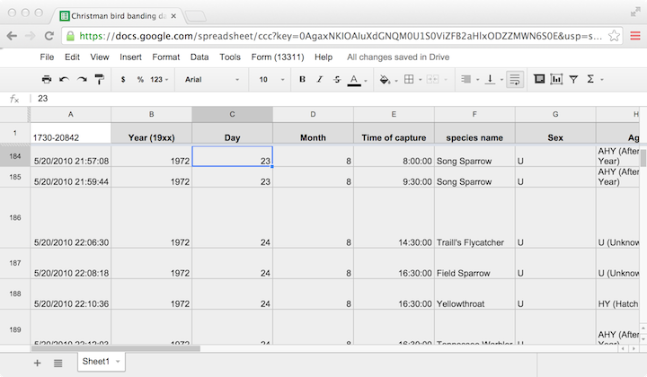

---
output:
  html_document:
    css: ~/KaplanFiles/DCF-2014/CSS/DCF-style.css
    fig_caption: yes
    toc: no
---

```{r child="/Users/kaplan/KaplanFiles/DCF-2014/CSS/DCF-common.Rmd"}
```

```{r include=FALSE}
require(lubridate)
library( XML )
library( RCurl )
library( data.table )
options( width=100 )


```

"Every easy data format is alike.  Every difficult data format is difficult in its own way."   --- inspired by Leo Tolstoy, **Anna Kerenina**


## Scraping and Cleaning Data

When you are working on a data-oriented project, it's likely that you already have a source of data; that may be what motivated the project in the first place.

These notes are meant to help you identify situations where accessing the data will be easy, and to spot and fix common errors in data files.

### Data Tables

The data table is a very common format for storing data.  If your data are in this format, you likely won't have much problem putting them into a form that can be read directly in to R or any other widely used technical computing environment.  

The first thing is to realize what names are used to refer to data tables.  Here are several, each with a brief description:

* CSV file. A non-proprietary text format that is very widely used for data exchange between different software packages.  
* Data tables in a technical software-package specific format:
    * Octave (and through that, MATLAB) widely used in engineering and physics.
    * Stata, commonly used for economic research
    * SPSS, commonly used for social science research 
    * Minitab, often used in business practices
    * SAS, often used for large data sets
    * Epi used by the Centers for Disease Control (CDC) for health and epidemiology data.
* Relational databases.  This is the form that much (most?) of institutional, actively updated data are stored in.  This includes business transaction records, government records, and so on
* Excel, a set of proprietary spreadsheet formats heavily used in business.  Watch out, though.  Just because something is stored in an Excel format doesn't mean it's a data table.  Excel is sometimes used as a kind of table-cloth for writing down data with no particular scheme in mind.
* Web-related
    * HTML `<table>` format
    * JSON
    * Google spreadsheets published as HTML
    * Application Programming Interfaces (APIs) such as SODA

The particular software and techniques for reading data in one of these formats, varies depending on the format.  For Excel or Google spreadsheet data, it's often sufficient to use the application software to export the data as a CSV file.  There are also R packages for reading directly from an Excel spreadsheet, which is useful if the spreadsheet is being updated frequently.

For the technical software package formats, the `foreign` R package's reading and writing functions are very useful.  For relational databases, even if they are on a remote server, there are several useful R packages, including `dplyr` and `data.table`.

CSV and HTML `<table>` formats are frequently encountered.  The next subsections give a bit more detail about how to read them into R.

#### CSV

CSV stands for comma-separated values.  It's a text format that can be read with a huge variety of softare.  It has a data table format, with the values of variables in each case separated by commas.  Here's an example of the first several lines of a CSV file:

```
"name","sex","count","year"
"Mary","F",7065,1880
"Anna","F",2604,1880
"Emma","F",2003,1880
"Elizabeth","F",1939,1880
```

The top row usually (but not always) contains the variable names.  Quotation marks are often used at the start and end of character strings; these quotation marks are not part of the content of the string.

Although CSV files are often named with the `.csv` suffix, it's also common for them to be named with `.txt` or other things.  You will also see characters other than commas being used to delimit the fields, tabs and vertical bars are particularly common.

An excellent function for reading CSV files into R is `fread()` in the `data.table` package.^[Another useful function, part of base R, is `read.csv()`.  The `fread()` function is generally better: faster, more flexible, etc.]  Combined with the `XML` and `RCurl` packages, you can even read files stored on other computers if you have a URL for the file.  For instance, here's a way to access a `.csv` file over the Internet.

```{r}
library( XML )
library( RCurl )
library( data.table )

# Find your own URL!
# Remember the quotes around the character string.
myURL <- "http://www.mosaic-web.org/go/datasets/SaratogaHouses.csv"
MyDataTable <-
  myURL %>% 
  getURLContent() %>%
  data.table::fread()
head( MyDataTable )
```

Reading from a file on your own computer is even easier.  You just need to have the file path, as can be found using `file.choose()`.  For instance:

```{r eval=FALSE}
# Call file.choose() then copy the string with the file path below
fileName <- "~/Project1/Important.csv"
MyDataTable2 <- 
  fileName %>%
  data.table::fread()
```

Useful arguments to `fread()`:

* `stringsAsFactors=FALSE` is useful particularly when you plan to be cleaning the data.
* `nrows=0` --- just read the variable names.  This is helpful when you are checking into the format and variable names of a data table.  Of course, you might also want to look at a few rows of data, by setting `nrows` to a small positive integer, e.g. `nrows=3`.
* `select=c(1,4,5,10)` allows you to specify the variables you want to read in.  This is very useful for large data files with extraneous information.
* `drop=c(2,3,6)` is like `select`, but drops the columns.

### HTML Tables

Web pages are usually in HTML format.  This format is much more general than the data table format; it's used for text, page arrangement, etc.  Sometimes, however, there is tabular data contained within the HTML page.  This will often look in your browser like the following:

 from Wikipedia.](wikipedia-running.png)


<div style="clear:both;"></div> <!-- break between caption and text -->


Within HTML, such tables are represented with the HTML `<table>` tag.

When you have the URL of a page containing one or more tables, it can be easy to read them in to R as data tables.  Here's the pattern.
```{r}
library( XML )
library( RCurl )
SetOfTables <- 
  "http://en.wikipedia.org/wiki/Mile_run_world_record_progression" %>%
  getURLContent() %>%
  readHTMLTable( stringsAsFactors=FALSE )
```


The result, `SetOfTables`, is not a table, it is a list of the tables found in the web page.  You can access any of those tables like this:

```{r}
length( SetOfTables )
```
There are `r length( SetOfTables )` identified by `readHTMLTable()`.

To look at the first one, 
```{r}
head( SetOfTables[[1]], 2 ) # Note: double square brackets
```

You can look at the second, third, and so on in the same way.  When you have found the table or tables you want, assign them to an object name.  For instance, the two tables shown in the figure above happen to be the third and fourth in `SetOfTables`.

```{r}
MyTable <- SetOfTables[[3]]
MyOtherTable <- SetOfTables[[4]]
```

```{r eval=FALSE,echo=FALSE}
save( SetOfTables, file="RunnersTables.rda")
# Save these so that you can keep the example even after the Wikipedia page changes
```


<div class="displayAsFigure">


`head( MyTable, 2 )`    
```{r results='asis', echo=FALSE}
head( MyTable, 2 ) %>% xtable
```
`head( MyOtherTable, 2 )`    
```{r results="asis", echo=FALSE}
head( MyOtherTable, 2 ) %>% xtable
```

<p class="caption"> The second and third tables embedded in the [Wikipedia page on records in the one-mile race](http://en.wikipedia.org/wiki/Mile_run_world_record_progression).</p>
</div> <!-- end of figure -->

<div style="clear:both;"></div> <!-- break between caption and text -->


### Cleaning Data

A person somewhat knowledgable about running would have little trouble interpreting the previous tables correctly.  The `Time` is in minutes and seconds.  The `Date` gives the day on which the record was set.

*Data cleaning* refers to taking the information contained in a variable and transforming it to a form in which that information can be used.  As an example, consider the spreadsheet from which the `OrdwayBirds` data table was extracted.



It's a simple matter to use the Google toolbar to download these data as a CSV file:


When the menu choice is made, the CSV file is put into a directory, from which it can be read with `fread()`.  Here, a random set of 50 is read. `r set.seed(101)`
```{r}
Random5000 <- 
  fread( "~/Downloads/BirdBanding-Sheet1.csv" ) %>%
  sample_n( size=5000 )
```

```{r echo=FALSE,results='hide'}
# the original file from Google had a line break at line 81 that needed fixing in emacs
# https://docs.google.com/spreadsheet/ccc?key=0AgaxNKIOAIuXdGNQM0U1S0ViZFB2aHlxODZZMWN6S0E&usp=sharing_eid#gid=0
varNames <- c( '1730-20842','Year (19xx)','Day','Month','Time of capture','species name','Sex','Age','Band number','Trap identification','Weather','Banding report?','Recapture?','Recapture date (month)','Recapture date (day)','Condition','Release','Comments','Data entry person','Weight','Wing chord','Temperature','"Recapture, original"','"Recapture, previous"','Tail length','Capture location')
names( Random5000 ) <- varNames
```

The initial step in cleaning a file is often to give the variables useful names.  Here are the names that come originally with the file:
```{r}
names( Random5000 )
```
At best, these are too long to be convenient. 

One way to change the names is like this:
```{r}
newNames <- c('code','year','day','month','time','species','sex','age','bandNum',
              'trapID','weather','bandingReport','recapture','recapMonth',
              'recapDay','condition','release','comments','dataEntryPerson',
              'weight','wingChord','temperature','OrigRecapture','previousRecapture',
              'tailLength','captureLocation')
names( Random5000 ) <- newNames
```

For simplicity, consider just a few variables:
```{r}
BirdData <- Random5000 %>%
  select( year, day, month, time, species, 
          weight, wingChord, tailLength )
head( BirdData )
```

A first step can be to check which *type* each of the variables is.
```{r}
str( BirdData )
```

Although the `weight`, `wingChord`, and `tailLength` variables are supposed to be numerical, they have been read in as character strings. The `as.numeric()` function can be used to convert them to actual numbers.  If the entries are non-numeric, they will be turned into `NA`.
```{r}
BirdData <- BirdData %>%
  mutate( weight=as.numeric(weight), 
          wingChord=as.numeric(wingChord),
          tailLength=as.numeric(tailLength) )
```
  
It's helpful to plot the distribution of each of the variables to look for outliers.
```{r fig.height=3, fig.width=5}
ggplot( data=BirdData, aes(x=weight)) + geom_density() 
ggplot( data=BirdData, aes(x=wingChord)) + geom_density() 
ggplot( data=BirdData, aes(x=tailLength)) + geom_density()
```

There are a few birds with a weight below zero but no other obvious anomolies.  When there are, you can filter those cases out of the data or turn them to `NA`.

```{r}
BirdData <- BirdData %>%
  filter( weight > 0 )
```

Similarly, check the other variables to make sure values are in line.  For instance, the month should be between 1 and 12 (inclusive):
```{r}
BirdData %>% 
  group_by( month ) %>% 
  summarise( count=n() )
```

Checking variables in this way is tedious, but saves trouble in the future.

Some variables provide no easy way to check, for instance `species`.  One helpful strategy is to count the number of instances of each level, and organize them in descending order of count.
```{r}
SpeciesCount <- BirdData %>% 
  group_by( species ) %>% 
  summarise( count=n() ) %>%
  arrange( desc(count) )
nrow(SpeciesCount)
```

Examine the counts by eye, using a spreadsheet program.  To do this, write the data to a CSV file:
```{r eval=FALSE}
write.csv( SpeciesCount, file="SpeciesCount.csv" )
```


In the count of species, you can see that the first several have large counts.  Species with very low counts may be mis-spellings.  Create another variable in the spreadsheet to place the corrected spelling.  Then, read the spreadsheet file back into R, filter out the cases where corrections were made, and join them with the original data.  (A join such as `left_join()` that keeps all the rows in the original table is appropriate.) 


<!-- SharedOnlineResources.Rmd -->


<!-- 311-Calls.Rmd -->

