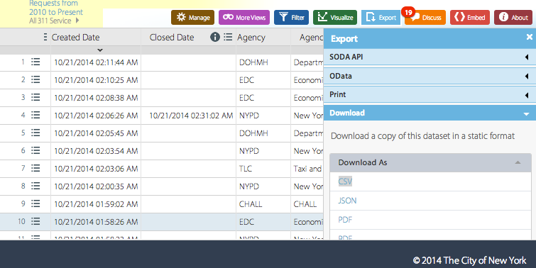

---
output:
  html_document:
    css: ~/KaplanFiles/DCF-2014/CSS/DCF-style.css
    fig_caption: yes
    toc: no
---

```{r child="/Users/kaplan/KaplanFiles/DCF-2014/CSS/DCF-common.Rmd"}
```

```{r include=FALSE}
require(lubridate)
```

"Every easy data format is alike.  Every difficult data format is difficult in its own way."   --- inspired by Leo Tolstoy, **Anna Kerenina**


## Data Formats

It's often surprisingly easy to access data tables in a variety of common formats.  When it's not easy, it can be very difficult indeed, requiring sophisticated programming skills and knowledge of data transmission formats, understanding of web-programming conventions, and so on.

These notes are not intended to show you how to solve the problems associated with difficult data formats.  Instead, the point is to help you identify when acquiring data is going to be easy.  When it is, you win.  When it's not, you likely want to enlist the help of an experienced programmer and data analyst.

### Computer Files

You may be aware that all computer files --- text, images, sounds, data tables, etc. --- are sequences of "binary digits," generally called "bits."  In this sense, all computer files are the same.  What's different between different "types" of files is how the bits are intended to be interpreted: the format of the file.

Often, data tables are made available in one of several standard formats for computer files that are specifically designed for data tables.  If the data you need are in one of these formats, you are likely to to have a pretty short path from the file you get to a data table that you can transfigure using the tools presented earlier.

Sometimes, the `.csv` files you want are already on the computer you are using for R (e.g., your own laptop).  For files distributed over the Internet, the file location is usually specified by a complete URL, for instance:    
`http://www.mosaic-web.org/go/datasets/DCF/CountryCodes.csv`

When a file is on your own computer, you can use the `file.choose()` function to find the complete path name interactively.  (But, because it's interactive, don't use `file.choose()` inside an RMD document.)

When a file is on the Internet, you can use a web browser to navigate to the site and then copy the URL for the file as a quoted character string in R.

#### CSV: Comma Separated Values

This is a simple format and widely used for data tables.  All data analysis software --- or even consumer or business software --- that you are likely to use can read this format.

Generally, CSV files will be named with the suffix `.csv`. 

Two good ways of reading `.csv` files to create a data table in R:

* `read.csv()` which takes as an argument the quoted character string giving the name of the file.
* `fread()` in the `data.table` package, which is used in the same way but more clever in dealing with a wider range of files.  It's also very fast, and so is the function to use when reading large files.

Here's a standard way to access a `.csv` file over the Internet.

```{r}
library( XML )
library( RCurl )
library( data.table )

# Find your own URL!
# Remember the quotes around the character string.
myURL <- "http://www.mosaic-web.org/go/datasets/DCF/CountryCodes.csv"
myDataTable <-
  myURL %>% 
  getURLContent() %>%
  data.table::fread()
```

Useful arguments to `fread()`:

* `stringsAsFactors=FALSE` is useful particularly when you plan to be cleaning the data.
* `nrows=0` --- just read the variable names.  This is helpful when you are checking into the format and variable names of a data table.  Of course, you might also want to look at a few rows of data, by setting `nrows` to a small positive integer, e.g. `nrows=3`.
* `select=c(1,4,5,10)` allows you to specify the variables you want to read in.  This is very useful for large data files with extraneous information.
* `drop=c(2,3,6)` is like `select`, but drops the columns.

```{r}
myURL <- "http://www.mosaic-web.org/go/datasets/DCF/CountryCodes.csv"
JustAPeek <- myURL %>% 
  getURLContent() %>%
  data.table::fread( nrows=2 ) 
names( JustAPeek )
```

#### Example: 311 Calls

In New York City, dialing 311 connects you to a complaint/request service.^[In the US, 911 is the phone number for emergency services.  311 is for non-emergency services.]  New York provides information about individual calls to 311 on a [web site](https://data.cityofnewyork.us/Social-Services/311-Service-Requests-from-2010-to-Present/erm2-nwe9?).

I want to see how the number of 311 calls for different reasons varies over time of day and day of the week.  I'm also interested in finding out whether there are hot spots for 311 calls, and how this depends on factors such as income.



That site provides an "Export" feature.  You can download the data in several formats: CSV is appropriate.  The resulting file is slightly larger than 1GB.  Using a web browser, I downloaded it to my `Downloads` directory.

##### What are the variables?

```{r}
CallsFile <- "~/Downloads/311_Service_Requests_from_2010_to_Present.csv"
CallsFile <- "~/Downloads/311-3-Cols.csv"
JustAPeek <- 
  CallsFile %>% 
  data.table::fread( nrows=2 ) 

names( JustAPeek )
```

For my purposes, `CreatedDate`, `Complaint Type`, and `Incident Zip` are all I need.  For other purposes, other variables might be important.

The three variables I need are numbers 2, 6, and 9.  I'll read in a few rows just to make sure things are working:
```{r eval=FALSE}
# Not being evaluated 
# SmallData <- 
#   CallsFile %>%
#   fread( nrows=10, select=c(2,6,9))
```

That looks like what I want.  Notice that the `Created Date` variable gives both date and time.  I'm going to want to convert that to a standard date/time object so that I can use the tools developed for that purpose.

Try more data, say, 10,000 calls, just to see if things work out:

```{r complaint0}
callsFile <- "~/Downloads/311-3-Cols.csv"
CallData <- 
  fread( callsFile, nrows=10000,
         na.strings=c("NA","N/A",""),
         stringsAsFactors=FALSE ) %>%
  select( time=`Created Date`, 
          complaint=`Complaint Type`,
          zip=`Incident Zip` ) %>%
  mutate( when=mdy_hms( time )) 
```


### Develop your analysis using a small file

Pick a random subset of a few dozen cases.  Develop your analysis on that.  When something goes wrong, you may be able to figure it out by looking at the data tables to make sure they are what you expect them to be. 

When you have something that works, you can increase the same to a few hundred, a few thousand, and so on.  At each size, deal with the new problems that appear.

```{r}
testSize <- 500
```

```{r echo=FALSE}
set.seed(1001)
```

```{r complaint1}
Small <-
  CallData %>%
  sample_n( size=testSize )
```

Take the most common forms of complaints.  Graph the number of complaints per hour on each of the days of the week.

Convert the date-time to hour and day of the week:
```{r complaint2}
Small <- Small %>%
  mutate( hour=hour(when), day=wday(when) )
```

Pull out the five most common kinds of complaints.

1. Count the type of each kind of complaint, pick out the top five.
    ```{r complaint3}
    howManyTypes <- 5
    CommonComplaints <- Small %>%
    group_by( complaint ) %>%
  summarise( count=n() ) %>%
  filter( row_number( desc(count)) <= howManyTypes )
```
2. Pull out only those complaints that are among the common ones.
    ```{r complaint4}
    JustBigOnes <- Small %>%
  inner_join( CommonComplaints )
```

Find how many complaints of each major type there are in each hour.
```{r complaint5}
CountByHour <- JustBigOnes %>% 
  group_by( complaint, hour ) %>% 
  summarise( count=n() )
```

Plot out the number versus hour.
```{r complaint6}
ggplot( data=CountByHour, 
          aes( x=hour, y=count )) +
  geom_point( aes(color=complaint) ) + 
  geom_line( aes(group=complaint))
```

That's promising.  The graphic doesn't show much, but there are not very many cases.  Try repeating the calculation, with about 10 times as much data.

```{r}
testSize <- 1000
```

```{r echo=FALSE}
set.seed(1001)
```

```{r echo=FALSE,ref.label=paste0("complaint",1:6)}
```

Looks good.  But look carefully for things that are not as you expect.  For instance, here, the only time complaints are made about heat/hot water, unsanitary condition, or plumbing is at hour zero.  It seems unlikely that people only call in about these problems at mid-night.  Therefore, you should look carefully at the data, tracing back the problem toward the original data.

For instance, look at a few of the plumbing problems in the data table that was used to create the glyph-ready data:
```{r}
JustBigOnes %>%
  filter( complaint=="HEAT/HOT WATER" ) %>%
  head()
```

All of the suspect complaints are recorded exactly at midnight!  Perhaps such complaints are entered in a different process, storing up all the complaints from the previous day.  In any event, some cleaning is called for.  Let's delete all the complaints recorded at 12:00:00 AM.

There are several ways to do this, for instance, before calculating the leading complaints, filter out the ones exactly at midnight:
```{r complaint2b}
Small <- Small %>%
  filter( hour!=0, minute(when)!=0, second(when)!=0 )
```

```{r echo=FALSE}
callsFile <- "~/Downloads/311-3-Cols.csv"
CallData <- 
  fread( callsFile,
         na.strings=c("NA","N/A",""),
         stringsAsFactors=FALSE ) %>%
  select( time=`Created Date`, 
          complaint=`Complaint Type`,
          zip=`Incident Zip` ) %>%
  mutate( when=mdy_hms( time ))
  
```

```{r}
testSize <- 50000
```


Try again ...

```{r echo=FALSE,ref.label=paste0("complaint",c(1,2,"2b",3,4,5,6))}
```

```{r}
testSize <- 50000
```


```{r echo=FALSE}
testSize <- 2131700
```

```{r echo=FALSE,ref.label=paste0("complaint",c(1,2,"2b",3,4,5,6))}
```


#### Are deaths seasonal?

[NY Deaths database](https://health.data.ny.gov/Health/Genealogical-Research-Death-Index-Beginning-1957/vafa-pf2s)

### Databases


### The Codebook

In addition to the data table itself, you will want to have access to the codebook.  Sometimes these are separate files, sometimes separate "tabs" in a spreadsheet, sometimes listings on web sites, and a variety of other formats.

Data table and codebook.  Even there, there is a lot of variation.

### CSV

* Use `read.csv()` --- 
    * do you want categorical as strings or factors
    * header and varnames
    
GOOGLE DRIVE: download as CSV.  Alternative: Publish as HTML

```{r}
name <- "https://docs.google.com/spreadsheet/pub?key=0Am13enSalO74dDR6OTdJUXRfRXM3SEdnOGpKWDl5Y3c&single=true&gid=0&output=html"
foo <- getURLContent( name ) # from RCurl
goo <-  readHTMLTable(foo)
```

#### Marital Status

```{r}
Navy <- "https://docs.google.com/spreadsheets/d/1Ow6Cm4z-Z1Yybk3i352msulYCEDOUaOghmo9ALajyHo/pubhtml?gid=1877566408&single=true"
foo <- getURLContent( Navy )
goo <- readHTMLTable( foo )
```

#### SPSS, SAS, STATA

* Use foreign package

#### EXCEL

    * Not just data, formulas and formatting as well.
    * Corresponding to a data table is one "sheet" in the spreadsheet.
    
#### Zip

### Databases


### Data on the Web

Download/Export

Example [311 Calls in NYC](https://data.cityofnewyork.us/Social-Services/311-Service-Requests-from-2010-to-Present/erm2-nwe9?)

How to read a URL

* queries and parameters 

`http://real-chart.finance.yahoo.com/table.csv?s=%5EGSPC&a=00&b=3&c=1950&d=09&e=21&f=2014&g=d&ignore=.csv`

Stock price data over the last 100 years --- it's a CSV file

#### Easy

HTML tables: look for `<tr>` `<td>`

XML package: `readHTMLTable()`

`readHTMLList()`

#### Medium

Special data format --- NYC Restaurants


#### Difficult

Something other than a table.


Grab some baby-related names [here](http://baby-names.familyeducation.com/browse/origin/african).  Use this, along with `BabyNames` to figure out the ethnicity distribution over the years.

### Some tools for big files

Data files available over the web are often stored in a way that 

`data.table::fread()` and other `data.table` functions?

`csvcut` from UNIX command line.

```
csvcut -c 1,2,3,4,6,9,50,51 311Calls.csv > 311Simple.csv
```