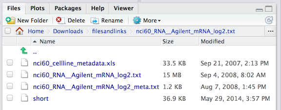

```{r include=FALSE}
require(mosaic)
require(dplyr)
require(ggplot2)
require(tidyr)
require(ScoreR)
startProblem("DCF-Assignment1")
```

```{r child="../CSS/DCF-common.Rmd"}
```

## Week 1 Drill


    
### Problem 1

Here is an excerpt from the baby-name data in `"DCF::BabyNames"`.

```{r echo=FALSE,results="asis"}
data(BabyNames)
xtable( BabyNames[round(seq(700003,1000000,length=8)),] )
```

For each of the following, say whether the variable is quantitative or categorical:

* `Taffy`: `r selectSet(name="babyTaffy",totalPts=1,
    "Categorical"=FALSE,
    "Quantitative"=FALSE,
    "It's not a variable."=TRUE)`
* `year`: `r selectSet(name="babyYear",totalPts=1,
    "Categorical"=FALSE,
    "Quantitative"=TRUE,
    "It's not a variable."=FALSE)`
* `sex`: `r selectSet(name="babySex",totalPts=1,
    "Categorical"=TRUE,
    "Quantitative"=FALSE,
    "It's not a variable."=FALSE)`
* `name`: `r selectSet(name="babyName",totalPts=1,
    "Categorical"=FALSE,
    "Quantitative"=FALSE,
    "It's not a variable."=TRUE)`
* `count`: `r selectSet(name="babyCount",totalPts=1,
    "Categorical"=FALSE,
    "Quantitative"=TRUE,
    "It's not a variable."=FALSE)`
  
  
### Problem 2  
  
```{r child="../Exercises/Introductory/2013-08-12-DTK-View-String.Rmd"}
```

### Problem 3

```{r child="../Exercises/Introductory/2013-08-12-DTK-World-Cities.Rmd"}
```

### Problem 4

```{r child="../Exercises/Introductory/2013-08-12-DTK-msleep.Rmd"}
```

### Problem 5

```{r child="../Exercises/Introductory/2013-08-12-DTK-Seatbelts.Rmd"}
```

### Problem 6

Say what content is associated each of the following filename extensions. 

`.csv` `r selectSet(name="csvExtension",totalPts=1,
    "Formatted document content"=FALSE,
    "Photograph"=FALSE,
    "Non-photo image"=FALSE,
    "Specification of the contents of a document"=FALSE,
    "Spreadsheet or data table contents"=TRUE,
    "R data and/or other objects"=FALSE,
    "A what-you-see-is-what-you-get document"=FALSE)`

`.Rmd` `r selectSet(name="rmdExtension",totalPts=1,
    "Formatted document for display in a browser"=FALSE,
    "Photograph"=FALSE,
    "Non-photo image"=FALSE,
    "Specification of the contents of a document"=TRUE,
    "Spreadsheet or data table contents"=FALSE,
    "Plain, unformatted text"=FALSE,
    "R data and/or other objects"=FALSE,
    "A what-you-see-is-what-you-get document"=FALSE)`

`.jpg` `r selectSet(name="jpgExtension",totalPts=1,
    "Formatted document for display in a browser"=FALSE,
    "Photograph"=TRUE,
    "Non-photo image"=FALSE,
    "Plain, unformatted text"=FALSE,
    "Specification of the contents of a document"=FALSE,
    "Spreadsheet or data table contents"=FALSE,
    "R data and/or other objects"=FALSE,
    "A what-you-see-is-what-you-get document"=FALSE)`

`.Rdata` `r selectSet(name="rdaExtension",totalPts=1,
    "Formatted document for display in a browser"=FALSE,
    "Photograph"=FALSE,
    "Non-photo image"=FALSE,
    "Specification of the contents of a document"=FALSE,
    "Spreadsheet or data table contents"=FALSE,
    "Plain, unformatted text"=FALSE,
    "R data and/or other objects"=TRUE,
    "A what-you-see-is-what-you-get document"=FALSE)`

`.docx` `r selectSet(name="docxExtension",totalPts=1,
    "Formatted document for display in a browser"=FALSE,
    "Photograph"=FALSE,
    "Non-photo image"=FALSE,
    "Specification of the contents of a document"=FALSE,
    "Spreadsheet or data table contents"=FALSE,
    "R data and/or other objects"=FALSE,
    "A what-you-see-is-what-you-get document"=TRUE)`

`.html` `r selectSet(name="htmlExtension",totalPts=1,
    "Plain, unformatted text"=FALSE,
    "Formatted document for display in a browser"=FALSE,
    "Photograph"=FALSE,
    "Non-photo image"=FALSE,
    "Specification of the contents of a document"=FALSE,
    "Spreadsheet or data table contents"=FALSE,
    "R data and/or other objects"=FALSE,
    "A what-you-see-is-what-you-get document"=FALSE)`

`.ppt` `r selectSet(name="pptExtension",totalPts=1,
    "Formatted document for display in a browser"=FALSE,
     "Plain, unformatted text"=FALSE,
    "Photograph"=FALSE,
    "Non-photo image"=FALSE,
    "Specification of the contents of a document"=FALSE,
    "Spreadsheet or data table contents"=FALSE,
    "R data and/or other objects"=FALSE,
    "A what-you-see-is-what-you-get document"=TRUE)`

`.png` `r selectSet(name="pngExtension",totalPts=1,
    "Formatted document for display in a browser"=FALSE,
    "Photograph"=FALSE,
    "Non-photo image"=TRUE,
    "Specification of the contents of a document"=FALSE,
    "Plain, unformatted text"=FALSE,
    "Spreadsheet or data table contents"=FALSE,
    "R data and/or other objects"=FALSE,
    "A what-you-see-is-what-you-get document"=FALSE)`
    
`.txt` `r selectSet(name="txtExtension",totalPts=1,
    "Formatted document for display in a browser"=FALSE,
    "Photograph"=FALSE,
    "Non-photo image"=FALSE,
    "Specification of the contents of a document"=FALSE,
    "Plain, unformatted text"=TRUE,
    "Spreadsheet or data table contents"=FALSE,
    "R data and/or other objects"=FALSE,
    "A what-you-see-is-what-you-get document"=FALSE)`

`.xls` `r selectSet(name="xlsExtension",totalPts=1,
    "Formatted document for display in a browser"=FALSE,
    "Photograph"=FALSE,
    "Non-photo image"=FALSE,
    "Specification of the contents of a document"=FALSE,
    "Plain, unformatted text"=FALSE,
    "Spreadsheet or data table contents"=TRUE,
    "R data and/or other objects"=FALSE,
    "A what-you-see-is-what-you-get document"=FALSE)`

### Problem 7

What is the path name of the files in this directory?



`r I(textItem("filePath"))`

### Problem 8

Which characters can be used in an object name?

### Problem 9

Here are a few characters: 
    .  ,  ;  _  -  ^  [space] (  )

* Which of those characters can be used in the name of an R object? `r I(textItem("objectCharacters"))`

* Which of those characters can be used in a quoted character string?

`r I(textItem("stringCharacters"))`

### Problem 10

The `date()` function returns an indication of the current time and date.

* What arguments does `date()` take? How did you find out?
* What *kind* of object is the result from `date()`.

`r I(textItem("date"))`

### Problem 11

For each of the following assignment statements, say what is the mistake.

* `ralph <- sqrt 10` `r selectSet(name="mistakeArgs",totalPts=1,
   "No mistake"=FALSE,
   "No assignment operator"=FALSE,
   "Unmatched quotes in character string"=FALSE,
   "Improper syntax for function argument"=FALSE,
   "Invalid object name")`
   
* `ralph2 <-- "Hello to you!"` `r selectSet(name="mistakeOperator",totalPts=1,
   "No mistake"=FALSE,
   "No assignment operator"=FALSE,
   "Unmatched quotes in character string"=FALSE,
   "Improper syntax for function argument"=FALSE,
   "Invalid object name")`

* `3ralph <- "Hello to you!"` `r selectSet(name="mistakeName",totalPts=1,
   "No mistake"=FALSE,
   "No assignment operator"=FALSE,
   "Unmatched quotes in character string"=FALSE,
   "Improper syntax for function argument"=FALSE,
   "Invalid object name")`

* `ralph4 <- "Hello to you!` `r selectSet(name="mistakeQuotes",totalPts=1, 
   "No mistake"=FALSE,
   "No assignment operator"=FALSE,
   "Unmatched quotes in character string"=FALSE,
   "Improper syntax for function argument"=FALSE,
   "Invalid object name")`

* `ralph5 <- date()` `r selectSet(name="mistakeNone",totalPts=1,
   "No mistake"=FALSE,
   "No assignment operator"=FALSE,
   "Unmatched quotes in character string"=FALSE,
   "Improper syntax for function argument"=FALSE,
   "Invalid object name")`
   
### Problem 12

These questions should be easy to answer if you use the appropriate commands to load, view, or get documentation on the datasets.

* How many variables are there in `CountryData`? 
* What does the variable `tfat` measure in the `NHANES` data table?
* How many cases are there in `WorldCities`?
* What's the third variable in `BabyNames`?
* What are the codes for the levels of the categorical variable `party` in the `registeredVoters` data table, and what does each code stand for?

`r I(textItem("DataAndHelp"))`
