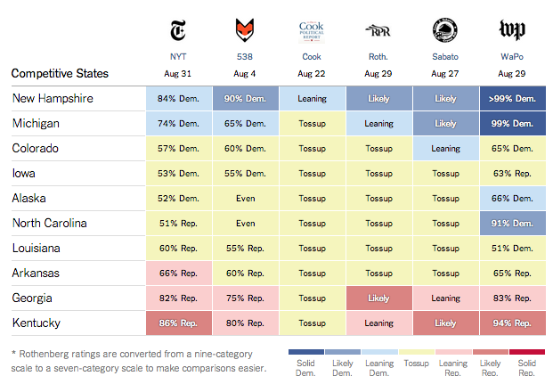

```{r include=FALSE}
require(mosaic)
require(dplyr)
require(ggplot2)
require(tidyr)
require(ScoreR)
startProblem("DCF-Assignment2")
```

```{r child="../CSS/DCF-common.Rmd"}
```

## Week 2 Drill

### Problem 1

The graphic below presents forecasts of the probabilities of winning US Senate elections in Nov. 2014.  The forecasts are made based on polls up through the end of August 2014.
Individual results from several different polling organization are shownSeveral diff The graphic is an excerpt from the [full graphic](http://www.nytimes.com/newsgraphics/2014/senate-model/comparisons.html), which shows predictions for all 36 senate seats up for election in 2014.  The numbers or words give the forecast probability of one party's candidate --- Democrat or Republican --- winning. Source: [New York Times](http://www.nytimes.com/newsgraphics/2014/senate-model/comparisons.html)



#### 1. 

What variables define the frame in this graphic?


`r f = newMC(totalPts=5,name="senateFrame")` 
`r I(f(FALSE))` Probability and State.
`r I(f(TRUE))`  State and Polling Organization.
`r I(f(FALSE))` Democrats and Republicans. 
`r I(f(FALSE))` Just State
`r I(f(FALSE))` Just Probability
`r I(f(finish=TRUE))`

<aside class="answer">
The vertical position represents the state.  The horizontal position reflects the polling organization.
</answer> 

#### 2. 

What is the glyph and its graphical attributes?

`r f = newMC(totalPts=5,name="senateGlyph")` 
`r I(f(FALSE))` Glyph: names of the states. Graphical attribute: font.
`r I(f(TRUE))`  Glyph: names of the polling organization. Graphical attribute: the organization's logo.
`r I(f(FALSE))` Glyph: Rectangle. Graphical attribute: color.
`r I(f(FALSE))` Glyph: Rectangle. Graphical attribute: color and text.
`r I(f(finish=TRUE))`

#### 3. 

Which of these is a guide for the indicated graphical attribute? (Select all that apply.)

* `r selectSet(name="senateGuideState", totalPts=1, "TRUE"=TRUE, "FALSE"=FALSE)` Vertical scale: Name of state.
* `r selectSet(name="senateGuideCandidate", totalPts=1, "TRUE"=FALSE, "FALSE"=TRUE)` Vertical scale: Name of candidate.
* `r selectSet(name="senateGuidePollV", totalPts=1, "TRUE"=FALSE, "FALSE"=TRUE)` Vertical scale: Name of polling organization.
* `r selectSet(name="senateGuideColor1", totalPts=1, "TRUE"=FALSE, "FALSE"=TRUE)` Vertical scale: color band.
* `r selectSet(name="senateGuideColor2", totalPts=2, "TRUE"=TRUE, "FALSE"=FALSE)` Color: color band.


#### 4. 

What sets the order of the categorical variable in the scale for the vertical variable?

`r selectSet(name="senateOrder",totalPts=4,
    "State"=FALSE,
    "Poll"=FALSE,
    "Roth poll probability for the Democratic candidate."=FALSE,
    "NYT poll probability for the Democratic candidate."=TRUE,
    "Date of the poll."=FALSE)`

  

`r I(endProblem())`
