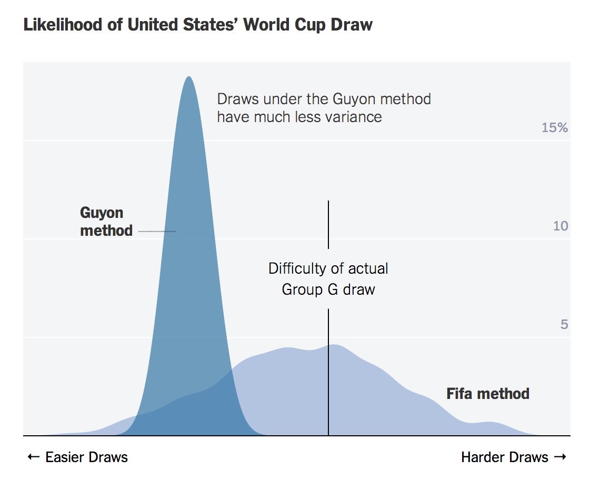

## Density Stats

Comparing the difficulty of the draw --- particularly the randomness in the difficulty --- using the FIFA and Guyon methods. [article in NYT](http://www.nytimes.com/interactive/2014/06/03/upshot/world-cup-draw-simulation.html)

Use this to explain the graphic: density/distribution, comparing two methods,  ... then ...

* How did the designer use translucency?

* What variable is being used to facet the graphs?
* What is the order of the faceting variable? (Hint: Ivory Coast is probably listed by FIFA by the French name: "Côte d'Ivoire.")
* The order makes it easy to look up a particular country.  What if the purpose was to highlight the countries that face high randomness versus those with low randomness, owing to the use of FIFA rather than Guyon.

