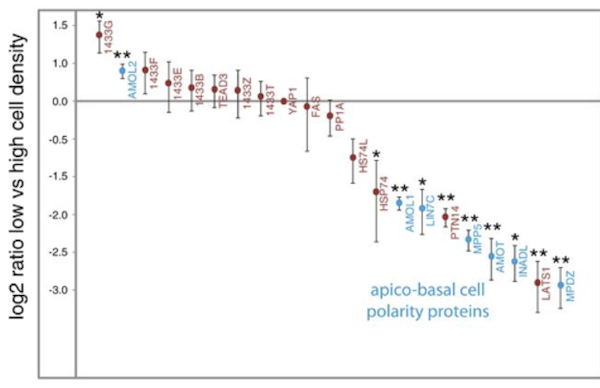
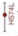

Consider this graphic:

Suppose the glyph-ready data underlying the graphic were structured as follows:

protein | center | low | high | polarity | signif
--------|--------|-----|------|----------|--------
1433G   | 1.35   | 1.18| 1.54 | plus     |   1
AMOL2   | 0.78   | 0.63| 1.01 | minus    |   2
1433F   | 0.79   | 0.18| 1.19 | plus     |   0
1433E   | 0.42   |-0.15| 1.01 | plus     |   0
$\vdots$ | $\vdots$ | $\vdots$ | $\vdots$ | $\vdots$ | $\vdots$ 

Consider these two kinds of glyph present in the graph:  and 

Tasks:

1. For each of the two glyphs, list the set of graphical attributes both geometrically (e.g. "dot") and in terms of the variable from the table that is mapped to that attribute (e.g., `polarity`).
2. Which variables define the frame?  Give variables for both the horizontal and vertical coordinates.
3. Is color an attribute of the  glyph?
4. What guides (if any) are displayed?

