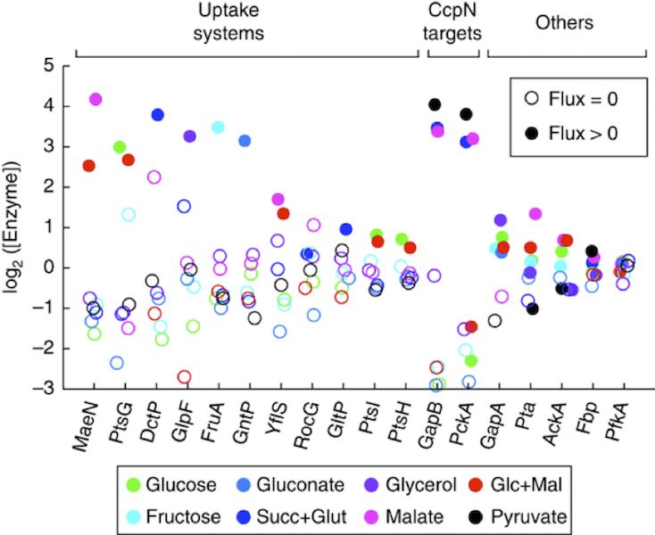

Here are some of the variables and their levels:

* Log enyzme `concentration`: numerical $-3$ to $5$
* `target`: CcpN, Uptake, Other
* `flux`: zero or positive
* `gene`: MaeN, PtsG, DctP, ...
* `molecule`: Glocose, Fructose, Gluconate, ...

1. List all of the **guides** in the graph.  For each one, say which variable is being mapped to which graphical attribute.
2. The basic glyph is a dot.  Say what are the graphical attributes of the dot (e.g. color, size, ...).  For each graphical attribute found in the graph, say which variable is mapped to that attribute.
3. Which two variables set the frame?
4. The scaling of the horizontal variable (e.g. the translation of position to variable levels) is set by a combination of two variables.  Which two?

