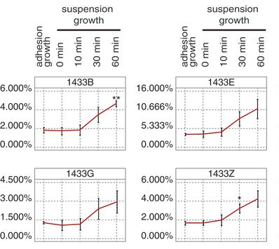

The chart above contains four facets.  Each shows the amount of a substance in different conditions:  

* when the cells are adhering to a surface
* when the cells are growing in suspension for different amounts of time

1. What are the labels/identifiers for the facets?
#. Are the frames the same in each facet?
#. There are three different glyphs shown in the frames.  Describe each type in terms of its graphical properties.

### Answers:

1. Facet labels: 1433B,1433E, 1433G, 1433Z
#. No. The scale of the vertical axis differs among the frames.
#. The glyph types are:  
    * A vertical "error bar"
    * A path connecting the mid-points of the error bars.
    * Single and double stars.

Comment: The usual scientific vernacular is that the error bars show the spread of several measurements and the stars indicate whether there is a statistically "significant" difference between the measurements marked and some reference condition.  Critique: It might be better to indicate the individual measurements rather than summarizing them using an error bar.  There's no particularly good reason for the path.  The reference condition isn't identified in the graph.

