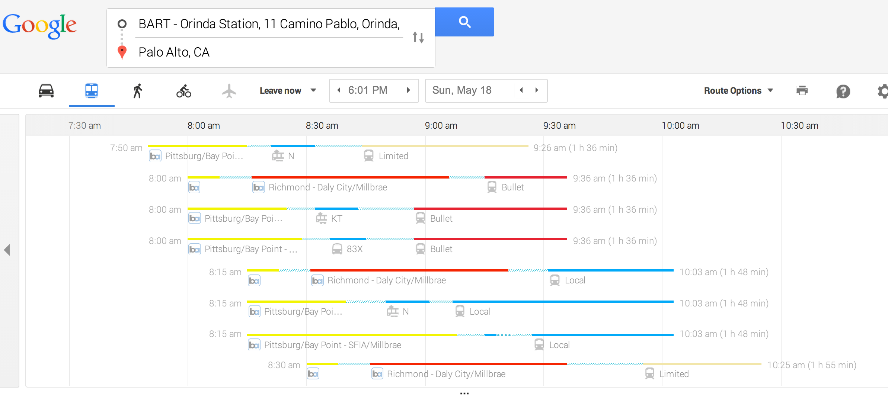

The graph, from Google Maps, shows mass transit options on a Monday morning for getting from Orinda, CA (in the East Bay), to Palo Alto, CA (in the West Bay).

1. Considering only that part of the graphic below the blue underlined bus and other modes of transportation, what is the frame?
2. Describe the different types of glyphs used.
3. For each different type of glyph
    * What information is encoded in the shape/style of the glyphs?
    * What information is encoded in the position of the glyph?
4. What guides are there?

