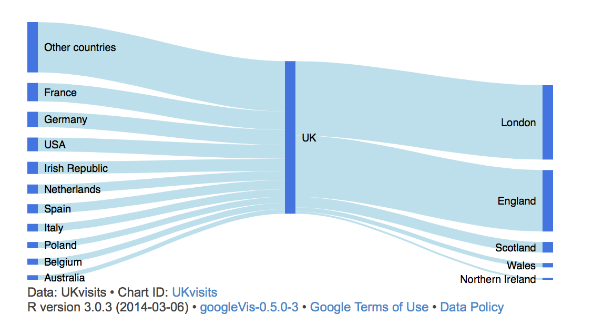
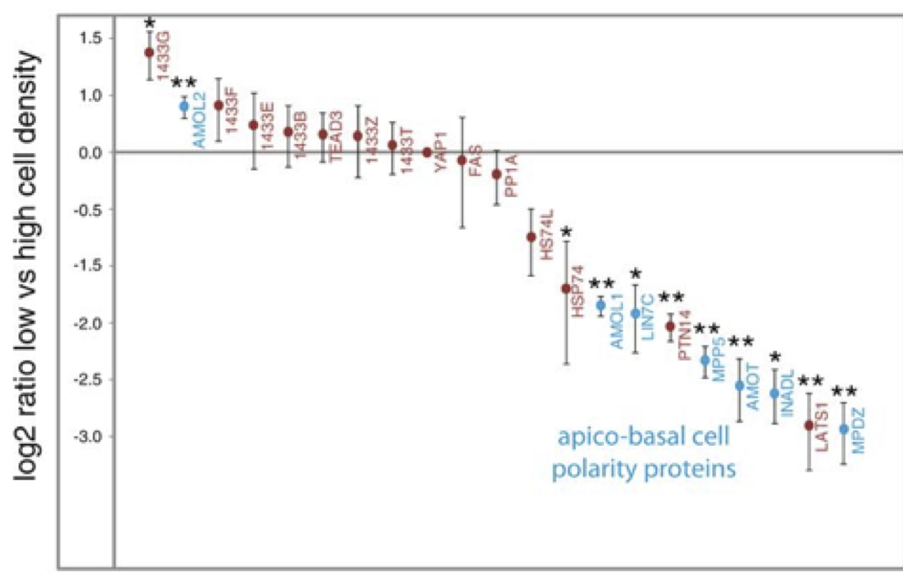
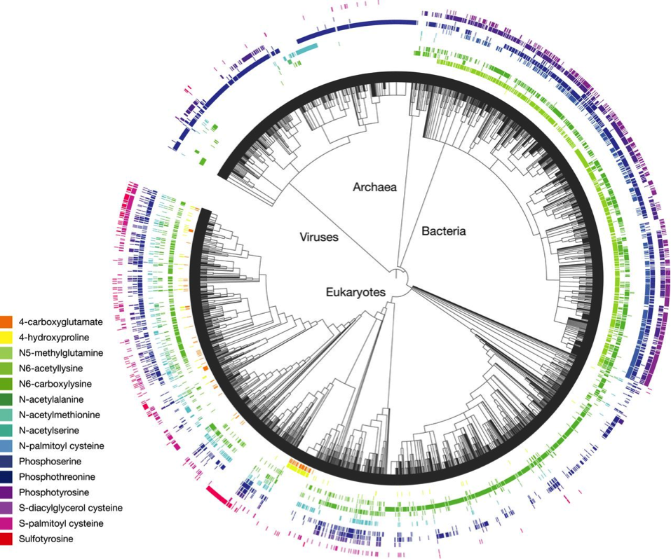

Stories have different genres and styles: mystery, romance, thriller, sci-fi, etc.  Similarly, graphics have different formats, different ways of presenting information.

Consider these graphics:
<table>
<tr>
<td><figure>

<figcaption>[Source](http://lamages.blogspot.com/2014/03/sankey-diagrams-with-googlevis.html)</figcaption>
</figure></td>
<td><figure>

<figcaption>Source [this blog](http://metvurst.wordpress.com/2014/04/18/reot-empirical-orthogonal-teleconnections-in-r-2/)</figcaption>
</figure></td>
<td><figure>

<figcaption>The caption</figcaption>
</figure></td></tr>

<tr>
<td><figure>

<figcaption>From [Andy Z](https://mail.google.com/mail/u/0/#search/overvoorde%40macalester.edu/1440cfd4222969ad)</figcaption>
</figure></td>
<td><figure>

<figcaption>From [Andy Z](https://mail.google.com/mail/u/0/#search/overvoorde%40macalester.edu/1440cfd4222969ad)</figcaption>
</figure></td>
<td><figure>

<figcaption>From [Andy Z](https://mail.google.com/mail/u/0/#search/overvoorde%40macalester.edu/1440cfd4222969ad),
[Source](http://msb.embopress.org/content/9/1/713)</figcaption>
</figure></td></tr>

<tr>
<td><figure>

<figcaption>From [Andy Z](https://mail.google.com/mail/u/0/#search/overvoorde%40macalester.edu/1440cfd4222969ad)</figcaption>
</figure></td>
<td><figure>

<figcaption>[source](http://msb.embopress.org/content/9/1/709)</figcaption>
</figure></td>
<td><figure>

<figcaption>heat map</figcaption>
</figure></td></tr>

<tr><td><figure>

<figcaption>Another heat map</figcaption>
</figure></td>
<td><figure>

<figcaption>Parallel Coordinates</figcaption>
</figure></td>
<td><figure>

<figcaption>Stacked Bar Chart</figcaption>
</figure></td></tr>

<tr><td><figure>

<figcaption></figcaption>
</figure></td>
<td><figure>

<figcaption></figcaption>
</figure></td>
<td><figure>

<figcaption></figcaption>
</figure></td></tr>

<tr><td><figure>

<figcaption>Trying too hard!</figcaption>
</figure></td>
<td><figure>

<figcaption></figcaption>
</figure></td>
<td><figure>

<figcaption></figcaption>
</figure></td></tr>

<tr><td><figure>

<figcaption></figcaption>
</figure></td>
<td><figure>

<figcaption></figcaption>
</figure></td>
<td><figure>

<figcaption></figcaption>
</figure></td></tr>

</table>

There is great diversity here.  The various graphics have different formats, use different symbols, differ in complexity. Some have bars, some have lines, some have trees, some vary color over an area. Each one of the graphics was thought by the person who created it to convey a message effectively for a given purpose.   The purpose might have been to organize data or --- in the worst cases --- to decorative.  The designer might have displayed good judgement or bad; the graphic might be effective or not. 

To make effective graphics, it helps to be able to think about the *different kinds* of graphics and which kinds might advance your purpose.  But what is the meaning of "different kinds of graphics"?

To get a start, look carefully at the collection and try to identify sets of individual graphs that have something important in common about the way they present data.  Try to imagine the sort of data that might have gone in to making the graphs.

## The Grammar of Graphics

English grammar (and that of other languages) is often used to identify which structures are correct and which incorrect.  This is a normative or prescriptive use.  For instance, here is a correct sentence: 

> "Amy gave Bill a pen."  

And here is a another expression that uses many of the same words: 

> "Pen Bill Amy a."  

The first is comprehensible; a real sentence.  It follows the rules of English grammar for a sentence.  This one has a noun, a verb, a direct and indirect object.
The second does not: it is just a set of words.

There's another use for grammar: to identify the roles of different words or phrases and help in the construction of complex expressions.  You can use grammar to take a sentence apart --- noun, verb, object --- and then create more complex or detailed sentences by substituting new expressions for the old ones.  "Amy gave Bill a pen," might be restyled, "The girl from the soccer team ended up handing over the red ballpoint to her friend."

A grammar of graphics has been proposed [Wilkinson, L. (2005),The Grammar of Graphics(2nd ed.). Statistics and Computing, New York: Springer] that enables graphics to be taken apart and put together.  One use for such a grammar is to enable people to describe the graphics they want so that computer can do the drawing.  The description has to be precise and unambiguous.  The use of grammar to define the interface between people and computers is important, [Wickham, [A layered grammar of graphics](http://mimno.infosci.cornell.edu/info3300/readings/layered-grammar.pdf).] particularly for software designers [Ref: `ggplot2`]

A grammar is also useful for the purpose of designing and thinking about graphics.  Among other things, it allows the designer to identify broad types of the components of graphics and to consider how to replace a given form of a component for one that might be better suited for the purpose at hand.  Taking apart the sentence, "Amy gave Bill a pen," allows you to think about how you might make the sentence more effective for your purpose. Noun, verb, indirect object, direct object. So "Amy" can be replaced with "The girl from the soccer team," or "the teacher," or "the sales clerk," among the infinity of possibilities.   All of the possibilities  play the role of a noun; some of them might accurately describe the situation.  Similarly, you might replace the verb (past tense) "gave" with another form of verb phrase that can take a direct and indirect object: "handed," "will present", "had given", "will have had given," etc.

Once you know that "Amy" is a noun, you can think about what other noun phrases might be more appropriate.  The grammar allows you to avoid limiting yourself.  For instance, a noun doesn't have to be a person: "The dispenser gave Bill a pen."

Usually when describing data-driven graphics [[is that a good name, **data-driven**]], people resort to naming the objects --- scatter plot, histogram, bar plot, pie chart, maps, etc. --- and describing the quantities or categories to be rendered: make a scatter plot of weight versus age.

As you'll see, it can help to have more general categories.  The categories and components to be used here may seem at first to be abstract and counter-intuitive.  For instance, scatterplots, bar plots, pie charts and maps are all different forms of the same kind of entity, even though they look very different.

### Glyphs, Frames, and Fields

(Is that what it's called, a frame?)

* A histogram is a kind of field.  There are others.

### Three basic kinds of graphics

Data-driven graphics relate data to graphical elements.  That's obvious.  A useful basic categorization of "kinds of graphics," will consider the structure of data and how that structure relates to the structure of the graphics, in particular to glyphs and frames.

Remember that data, as the word is used here, consists of cases and variables.  The characterization of graphics in terms of data must identify the roles played by cases and variables.  It might not be what you are expecting.

#### One case per glyph

#### Two (or more) cases per glyphs

#### Fields and the collective features of data 

[[[It's not called a glyph here]]] but a field.

### Other elements of graphics

* Guide
* Scale
* Axis

### Layered graphics

