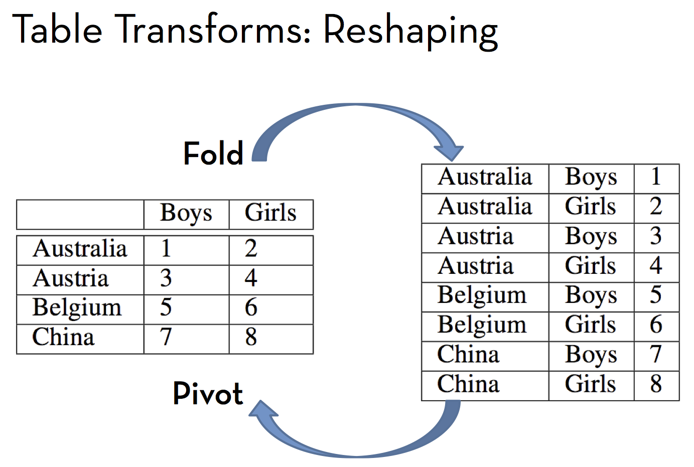

```{r include=FALSE}
require(dplyr)
```

## Developing Data

It's convenient when data come to you in glyph-ready form.  But often, the data you have with are not exactly what you need.  They contain information of interest, but not in a form that's ready for presentation.  The process of putting your data into the right form for your purpose is called **data wrangling**.  This differs from **data collection** or **data acquisition**.  In wrangling, you're not recording new information but re-arranging or transforming existing information to a more helpful form.  

The word "wrangling" is motivated by the image of cowboys at work.  Cowboys round up cattle, go after strays, and generally put the cattle in good order for the purpose at hand, whether that be leading the cattle up to a spring meadow, moving them to market, or preparing them for feeding.  You won't be feeding your data, but after you've spent some time with them, you'll get the sense that data need care: curating.

Wrangling data takes thought.  Usually, it's not that hard to sketch out the final form you imagine you need (e.g. the glyph-ready form).  Computers provide the operations and effort needed, but you need to know how to use and sequence those operations.

This section describes a small set of operations that are useful for wrangling.  The individual operations are simple.  Yet they can be combined in an infinite variety of ways.  You have to find the combination and sequence that leads you from the form of data you have to the form required for the presentation you want to make.

It's worthwhile to memorize the set of operations, even before you know what they do.  The names used here will are chosen to make it easy to remember the R functions that you will use in these notes. (Aside: Reference and describe Hadley Wickham's `dplyr` package.) Other computer systems use different names, but the concepts remain the same.

* Summarize
* Group
* Filter
* Select
* Mutate
* Melt and Cast, "Pivot" and "Fold", wide and narrow
    Melt and cast are Hadley's terms.  Pivot and Fold are from *Data Transformation_ Skills of the Agile Data Wrangler Presentation.pdf*.  Fold takes multiple columns and turns them into multiple cases.  Pivot goes the other way.  A "pivot table" in Excel seems to be along the same lines as the pivot operation.  Fold takes wide to long.  Pivot takes long to wide.
* Join

[[Note in DRAFT: I'm leaving out `arrange()`.  What others??]]

Notice that these are all verbs.  Using these operations, you're going to be doing things to data tables.  Each of these operations will take an input and produce an output.  The input will always be one (or more) data tables along with details of the operation. The output will always be a data table, usually one that has different cases or variables than the input.

### Mutate: calculate a new variable

Difference between wife's and husband's height.

NHANES --- create a new body-mass index which is height/weight or maybe height/sqrt(weight) or (using simple geometrical arguments), height^3 / weight.  Show that the standard BMI is the  one that is most independent of height or weight.  That is, it doesn't contain the same information as height or weight.

### Group and Summarize

In general, a summary is a concise description that leaves out details that are not central.  The summarize operation on data tables works along these lines these lines but is very much more specific.  Whereas a data table in general can have many cases and variables, the output from summarizing is a data table with **only one row per group**.  You get to choose what aspects of the input data table you put in that single row.

To illustrate, consider the Galton data on the heights of parents and their adult children:
```{r}
str(mosaic::Galton)
```

The `summarize()` function reduces all the cases in a group to a single case that contains the quantities you specify.

```{r}
summarize( mosaic::Galton, mKid=mean(height)  )
```

Unless you specify differently, a data table has only one group.  You can change this with the `groupBy()` function.  Here, for instance, the Galton data is broken down into two groups, one for each sex.

```{r}
GaltonBySex <- group_by( mosaic::Galton, sex )
```

`Summarize()` recognizes the grouping and does what you would expect:
```{r}
summarize( GaltonBySex, mKid=mean(height)  )
```


You can calculate more than one thing in the same operation, but always the output will have just one case for each input group.

```{r}
summarize( GaltonBySex, mKid=mean(height), mMother=mean(mother)  )
```

#### Counting cases

Number of counties in each state.

#### Sums

Add up populations across counties in a state.

#### Extremes

Most populous zip code in each state.


#### EXERCISES

Give a `summary()` of a data frame.  Ask how many distinct groups will be produced by
* `group_by( data, onevar)`
* `group_by( data, first, second)`

Galton: ask to group by family and find the standard deviation of father, mother, and nkids.  Then group on whether this is zero, and tally.   GENERALLY, use filter to pull out cases not in a set of standard cases.

I have a data table like this [ungrouped] and I want to get to one like this [summarized and grouped].  DCF and DCF mean height by sex and diabetic.


### Filter and Select

Recall that a data table consists of rows and columns --- cases and variables.  There are times that your interest is in a subset of the variables, and other times when you want to construct a subset of the cases.
The `select()` and `filter()` functions from R/dplyr carry out these operations. 

Be aware that the names *select* and *filter* are arbitrary.  It's hard to remember which one does what.  Indeed, other systems use different words or use these words with a different meaning.  In SQL, for example, the action of `filter()` is carried out by the keyword `SELECT`, while R/dplyr `select()` corresponds to SQL `PROJECT`.  [[**to do** --- check this claim.]]  

Although you will get confused about the names of the functions, the distinct operations provided `filter()` and `select()` are easy to keep straight.  `Select()` extracts a subset of **variables**.  `Filter()` extracts a subset of **cases**.

`Select()` and `filter()` are data table transforms: each takes a data table as input and produces a data table as output.  In addition to the data table input, `select()` and `filter()` take take inputs telling which variables or which cases to put in the output data table.

With `select()`, the additional inputs are the names of the variables that you want in the output.  For example:

```{r}
names( mosaic::Galton)
result <- select( mosaic::Galton, height, sex )
names(result)
```

You can list as many, or as few, variables as you want.  If, for some reason, you want the output data table to use a different variable name, you can indicate this using named arguments `=`.  For instance:
```{r}
result2 <- select( mosaic::Galton, kid=height, mother, father, kidsSex=sex)
names(result2)
```

If you can remember that `select()` picks variables, it's easier to remember that `filter()` picks cases.  With `select()`, you specify the desired variables by name.  With `filter()` there are other ways to indicate which cases you want.  The central idea is that you specify a *criterion*.  If the case meets the criterion, then that case will be included in the output data table.  If the case does not meet the criterion, it won't be in the output.

The criterion is given by an R expression using the variables in the data table.  Here are some examples of criteria that might be appropriate for the `mosaic::Galton` data:

* `sex=='F'` --- the cases for females.  Note the **double equal sign** and the quotes that are used with levels of categorical variables.
* `mother > 65` --- cases where the mother is taller than 65 inches
* `mother > father` --- cases where the mother is taller than the father
* `mother >= (father+3) --- cases where the mother is at least three inches taller than the father.  Note the parentheses used for arithmetic grouping.
* `mother > mean(mother)` --- cases where the mother is taller than the average mother

Criteria can get more elaborate.  In particular, multiple criteria can be combined.  The basic combination functions are `and()` and `or()`.  There's also a `not()` that turns the criterion around.  For example:

* `and(mother>60, mother<65)` --- cases where the mother is between 60 and 65 inches
* `and(mother>70,father>70)`  --- cases where both parents are taller than 70 inches
* `or(mother>70,father>70)` --- cases where at least one parent is taller than 70 inches
* `not(father==65)` --- cases where the father is anything but 65 inches tall

The criterion is the second argument to `filter()`.  The first argument is the data table.  For example:

```{r}
nrow( mosaic::Galton )
ex1 <- filter( mosaic::Galton, sex=='F') 
nrow(ex1)
ex2 <- filter( mosaic::Galton, mother >= father + 3)
nrow(ex2)
```

#### Note

Distinction between `group_by()` and `filter()`.  Grouping might initially look like filtering, but none of the cases that are in the output are verbatim input cases.


### Exercises

* Regression to the mean.  Find the difference between the father's and son's heights. Plot (`bwplot()`) this against the father's height.  Notice that the tallest fathers tend to have the most positive difference.  This was called "regression," since the son is closer to the mean than the father.  Originally, this was interpreted as a causal relationship.  But notice that the same relationship applies backwards: taller sons (or daughters) tend to have fathers that are closer to the mean.  Is it the case that taller mothers have husbands who are closer to the mean in height?  (Regression says yes, but maybe there are causal influences that create a relationship between wives and husbands.) 

* Use `mutate()` to create a new variable in `mosaic::Galton` that tells how much taller the mother is than the father.  Then use `filter()` to pick out the cases where the mother is three inches taller than the father.  Remember to instruct them to make a copy: `Galton <- mosaic::Galton`


How does Filter and Select get applied by groups?


### Pivot and Fold

 from *Data Transformation_ Skills of the Agile Data Wrangler Presentation.pdf*

### Join (its own chapter!)

* Merge zip code location with city population data: `CaseStudies/Cities` and `CaseStudies/ZipCodes/zip_codes_state.csv`
* Getting rid of very common words in word counts: is this `anti_join()`.  Count the words, define a threshold, then perhaps edit the list by hand.   Compare to Mosteller's *Federalist Papers*, where they used very common words to identify authors.  Get their description of what they did.


#### Technical stuff

Count with `n()`

ASIDE: Chaining with `%.%`

Naming the grouping variables

Using `ntiles()` on a categorical variable.

TIP:  Don't confuse the `summarize()` function with other tools such as `str()` for presenting data in short form.  For instance, the `summary()` function gives a quick overview of a data table, e.g.
```{r}
summary(mosaic::Galton)
```
`Summary()` and `summarize()` have little in common except the first six letters of their names.

`select()`: picking out multiple variables.  Use `:` .  Hadley has written some more:

> As well as using existing functions like : and c, there are a number of special functions that only work inside select.
    * starts_with(x, ignore.case = FALSE): names starts with x
    * ends_with(x, ignore.case = FALSE): names ends in x
    * contains(x, ignore.case = FALSE): selects all variables whose name contains x
    * matches(x, ignore.case = FALSE): selects all variables whose name matches the regular expression x
    * num_range("x", 1:5, width = 2): selects all variables (numerically) from x01 to x05.

> To drop variables, use `-`. You can rename variables with named arguments.

Also, see `select_vars()` whih lets you pick variables from a list.


