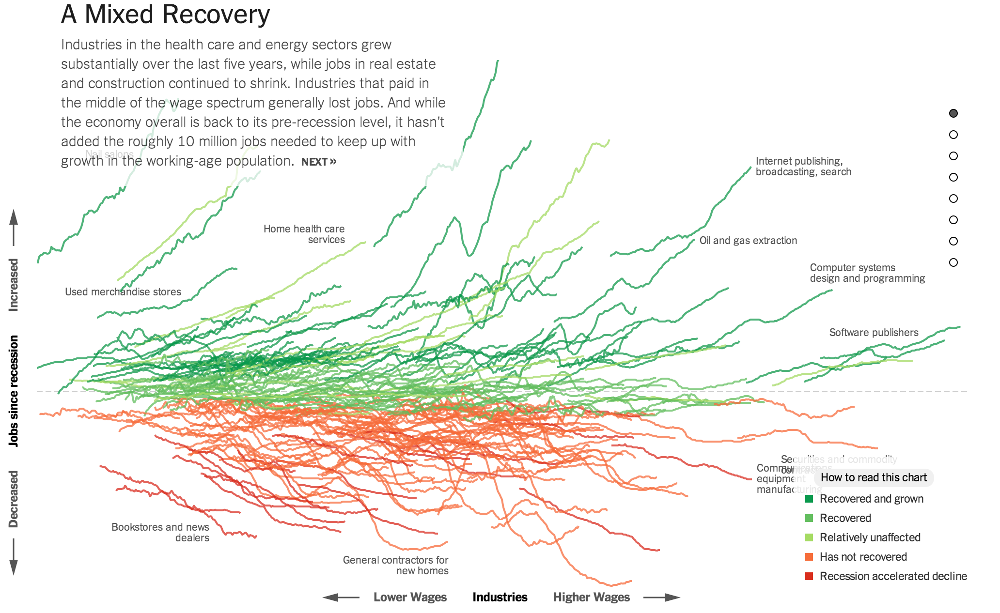
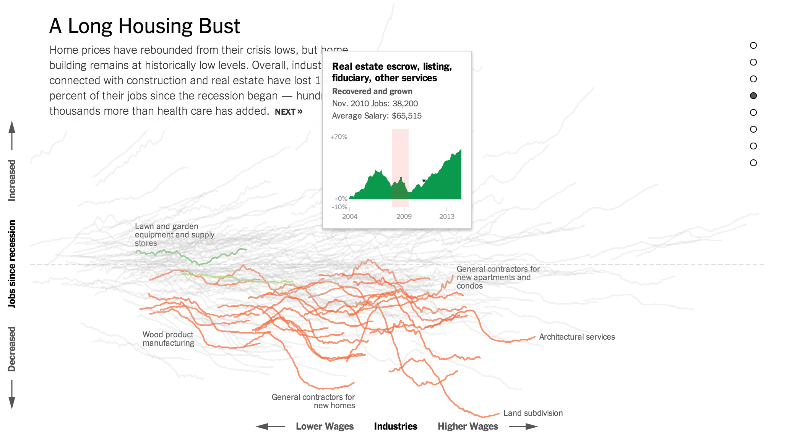

This is a somewhat complicated example about ordering categories. 

The graphic is about changes in numbers of jobs before and after the "great recession" of 2008.  The caption for the graph reads:

> **How to read this chart**.  Each line on the chart represents a private-sector industry and shows that industry’s change in employment over the last decade. The lines are placed on the x axis (horizontally) based on the average wages paid in that industry. They are placed on the y axis (vertically) based on the percentage change in employment since the start of the recession in December 2007.

The lines themselves reflect the percentage change from 2004 to 2014 in the number of jobs in that sector over time. 

It would seem natural to plot each of the sectors on a scale of "job growth" versus time.  Moving the cursor over a line shows a pop-up graph of 
changes in the number of jobs over time.  The pop-ups look like this:

This particular sector, having to do with financial services in real estate, grew from 2004 to 2006, then declined back to the 2004 levels by 2009.  Since 2009, the job numbers have grown.  This is the classic story of job loss during a recession and recovery after the recession.  Many of the job sectors, however, do not show recovery.

If the job change lines had all been drawn on the same "Job change" versus time scale, the lines would overlap and be illegible.  To separate the sectors, the start of each line is placed in a different spot.  That spot contains information however.  The horizontal placement reflects the relative average wages in the sector.  The vertical placement reflects the growth or decline of that sector (in terms of the number of jobs) since 2008.  You can see that the lines above the middle tend up for the second half of the period; lines below the middle tend down for the second half of the period.

Structuring the position of the lines in this ordered, two-dimensional way allows the reader to see how low-wage jobs have fared over time compared to middle- and high-wage jobs.  It also allows the reader to see, at a glance, the distribution of growth or decline as a function of average wage, while retaining the underlying "growth versus time" shape of the graph.

The original interactive graph in the New York Times ([link here](http://www.nytimes.com/interactive/2014/06/05/upshot/100000002921391.app.html?_r=0)) rewards patient exploration.  Not surprisingly displaying five variables (wage, job number, time, growth since 2008, name of sector) is challenging.