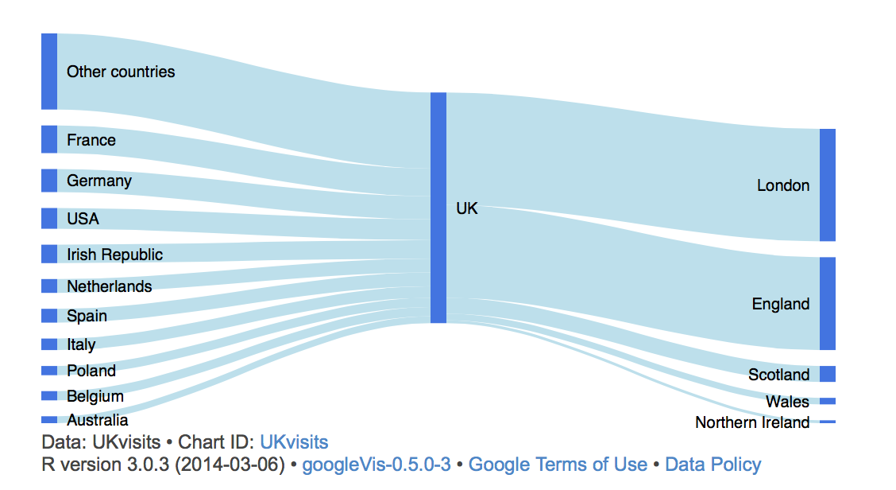
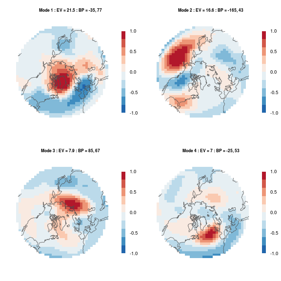
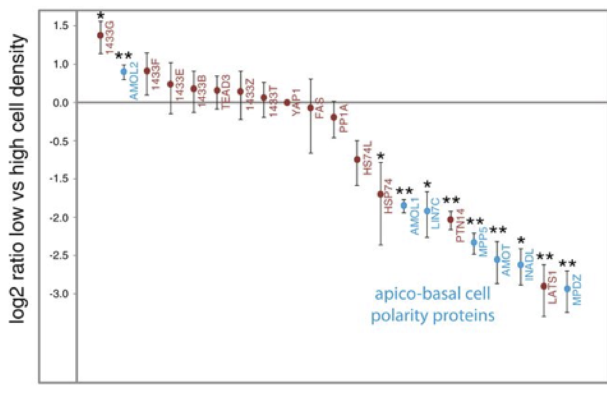
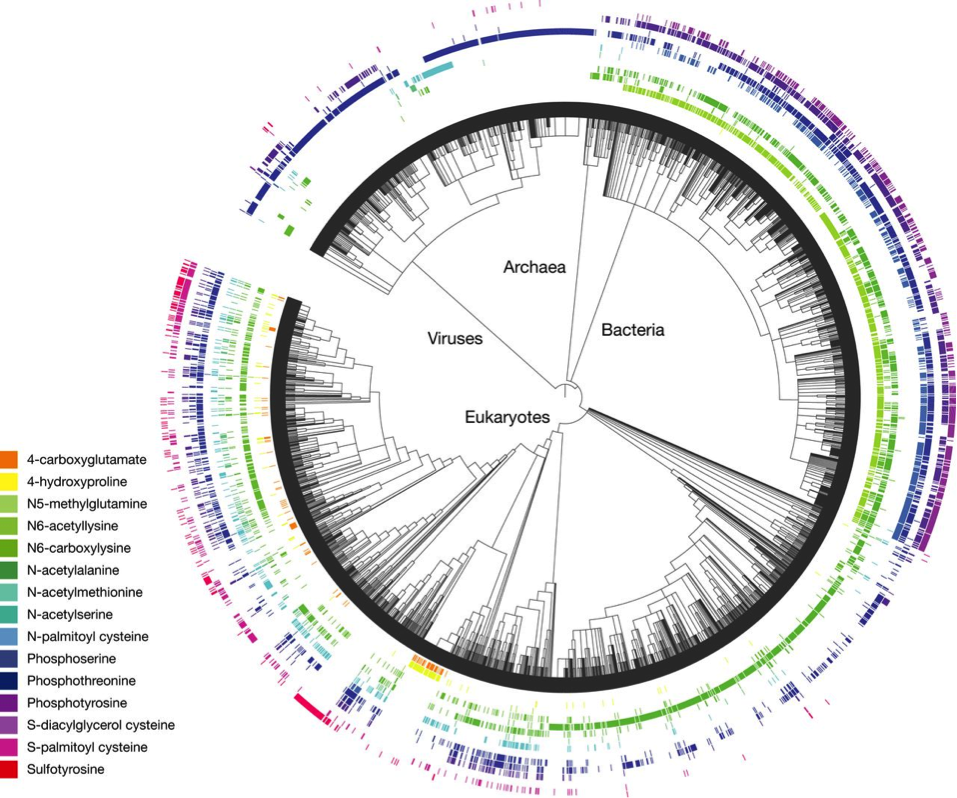
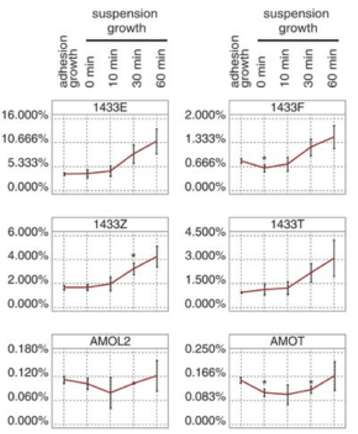

Stories have different genres and styles: mystery, romance, thriller, sci-fi, etc.  Similarly, graphics have different formats, different ways of presenting information.

Consider these graphics:
<table>
<tr>
<td><figure>

<figcaption>[Source](http://lamages.blogspot.com/2014/03/sankey-diagrams-with-googlevis.html)</figcaption>
</figure></td>
<td><figure>

<figcaption>Source [this blog](http://metvurst.wordpress.com/2014/04/18/reot-empirical-orthogonal-teleconnections-in-r-2/)</figcaption>
</figure></td>
<td><figure>

<figcaption>The caption</figcaption>
</figure></td></tr>

<tr>
<td><figure>

<figcaption>From [Andy Z](https://mail.google.com/mail/u/0/#search/overvoorde%40macalester.edu/1440cfd4222969ad)</figcaption>
</figure></td>
<td><figure>

<figcaption>From [Andy Z](https://mail.google.com/mail/u/0/#search/overvoorde%40macalester.edu/1440cfd4222969ad)</figcaption>
</figure></td>
<td><figure>

<figcaption>From [Andy Z](https://mail.google.com/mail/u/0/#search/overvoorde%40macalester.edu/1440cfd4222969ad),
[Source](http://msb.embopress.org/content/9/1/713)</figcaption>
</figure></td></tr>

<tr>
<td><figure>

<figcaption>From [Andy Z](https://mail.google.com/mail/u/0/#search/overvoorde%40macalester.edu/1440cfd4222969ad)</figcaption>
</figure></td>
<td><figure>

<figcaption>[source](http://msb.embopress.org/content/9/1/709)</figcaption>
</figure></td>
<td><figure>

<figcaption>heat map</figcaption>
</figure></td></tr>

<tr><td><figure>

<figcaption>Another heat map</figcaption>
</figure></td>
<td><figure>

<figcaption>Parallel Coordinates</figcaption>
</figure></td>
<td><figure>

<figcaption>Stacked Bar Chart</figcaption>
</figure></td></tr>

<tr><td><figure>

<figcaption></figcaption>
</figure></td>
<td><figure>

<figcaption></figcaption>
</figure></td>
<td><figure>

<figcaption></figcaption>
</figure></td></tr>

<tr><td><figure>

<figcaption>Trying too hard!</figcaption>
</figure></td>
<td><figure>

<figcaption></figcaption>
</figure></td>
<td><figure>

<figcaption></figcaption>
</figure></td></tr>

<tr><td><figure>

<figcaption></figcaption>
</figure></td>
<td><figure>

<figcaption></figcaption>
</figure></td>
<td><figure>

<figcaption></figcaption>
</figure></td></tr>

</table>

There is great diversity here.  The various graphics have different formats, use different symbols, differ in complexity. Some have bars, some have lines, some have trees, some vary color over an area. Each one of the graphics was thought by the person who created it to convey a message effectively for a given purpose.   The purpose might have been to organize data or --- in the worst cases --- to decorative.  The designer might have displayed good judgement or bad; the graphic might be effective or not. 

To make effective graphics, it helps to be able to think about the *different kinds* of graphics and which kinds might advance your purpose.  But what is the meaning of "different kinds of graphics"?

To get a start, look carefully at the collection and try to identify sets of individual graphs that have something important in common about the way they present data.  Try to imagine the sort of data that might have gone in to making the graphs.

