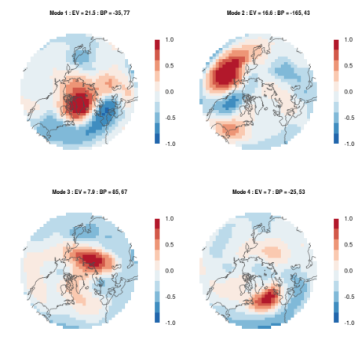

# A catalog of miscellaneous graphis

## Fields

Atmospheric Science: Winter mean 700 mb height over the Northern Hemisphere

Source: <http://metvurst.wordpress.com/2014/04/18/reot-empirical-orthogonal-teleconnections-in-r-2/>