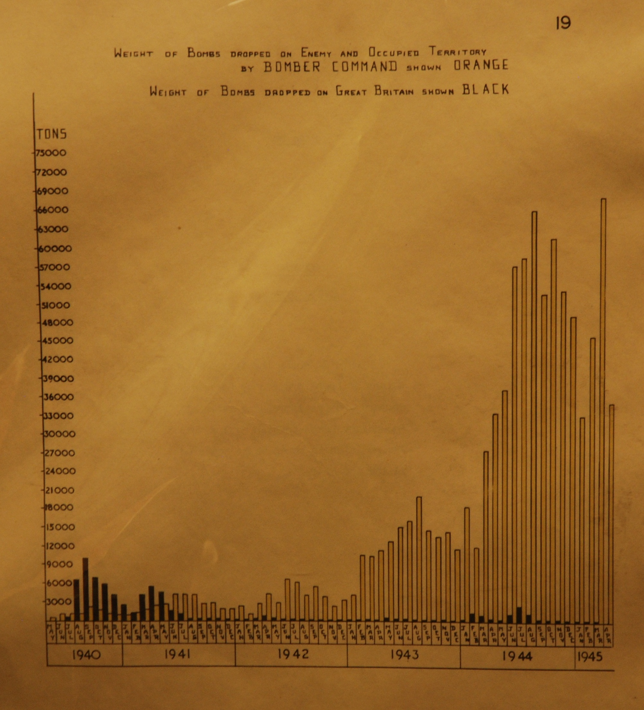
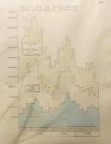
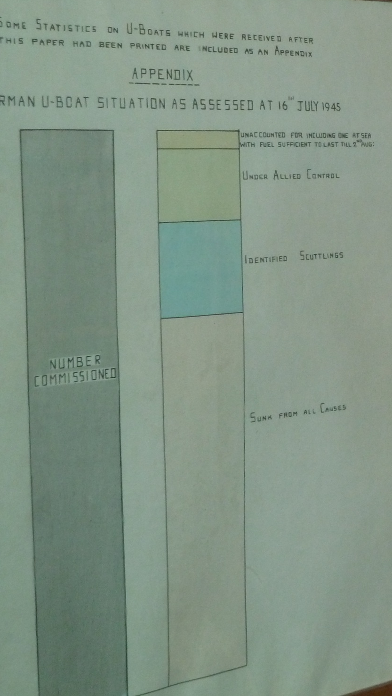
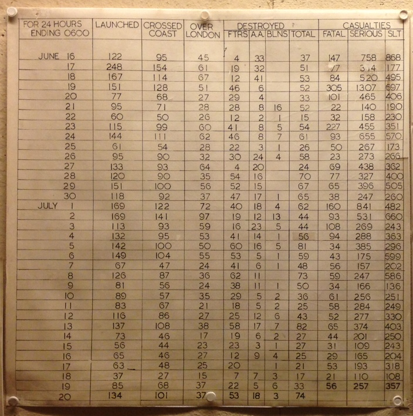

## Churchill War Rooms

* Tons of bombs in World War II. <http://www.peacockworks.com/wp-content/uploads/2012/12/Bombs-in-Weight-Dropped-in-WW2.jpg> 

* Disposition of German submarines at end of war.

 [Source](http://blog.revolutionanalytics.com/2011/06/ww2-dataviz.html)

 [Source](http://blog.revolutionanalytics.com/2011/06/ww2-dataviz.html)

* Flying bomb stats.  Source: DTK July 2014

