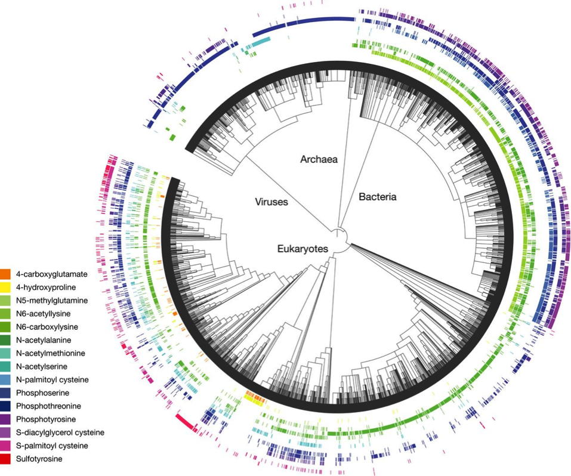

The chart below is complex.  Your job is to take it apart.

There are two adjacent frames in this chart. They happen to be arranged concentrically.  Call them "inner" and "outer" for the purposes of identifying them. For each of the frames:

a. What kind of graph is in the frame?
#. What are the scales that define the meaning of space in each frame?

